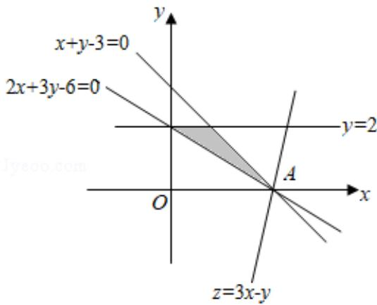

> [!faq]- 2019年全国统一高考数学试卷（文科）（新课标ⅱ）（含解析版）解析
>
> > [!success]- **【答案】** . 【
>
> > [!note]- **【分析】**
> > 由约束条件作出可行域，化目标函数为直线方程的斜截式，数形结合得到最优解，把最优解的坐标代入目标函数得
>
> > [!note]- **【解析】**
> > 解：由约束条件 $\left\{\begin{aligned}&2x+3y-6\geqslant0,\\&x+y-3\leqslant0,\\&y-2\leqslant0,\end{aligned}\right.$ 作出可行域如图：
> >
> > 
> >
> > 化目标函数 $z = 3x - y$ 为 $y = 3x - z$ ，由图可知，当直线 $y = 3x - z$ 过 $A(3,0)$ 时，直线在 $y$ 轴上的截距最小， $z$ 有最大值为9.
> >
> > 故
