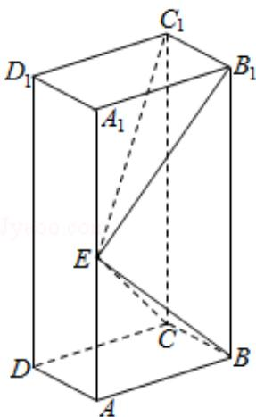

<!-- question-source:start -->
17. （12 分）如图，长方体 $ABCD - A_{1}B_{1}C_{1}D_{1}$ 的底面 ABCD 是正方形，点 E 在棱 $AA_{1}$ 上， $BE \perp EC_{1}$ .

(1) 证明: $BE \perp$ 平面 $EB_{1}C_{1}$ ;

(2) 若 $AE = A_{1}E$ ，AB = 3，求四棱锥 $E - BB_{1}C_{1}C$ 的体积.

<!-- question-source:end -->

![[高中/真题/按年份分类/2019/2019年全国统一高考数学试卷_文科__新课标ⅱ__含解析版_/解答题/题目/answers/Q00025180A1.md]]
