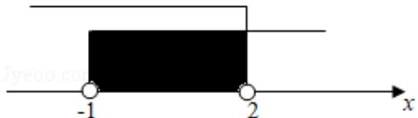

> [!faq]- 2019年全国统一高考数学试卷（文科）（新课标ⅱ）（含解析版）解析
>
> > [!success]- **【答案】** C
>
> > [!note]- **【分析】**
> > 直接利用交集运算得
>
> > [!note]- **【解析】**
> > 解：由 $A=\{x|x>-1\}$ ， $B=\{x|x<2\}$ ，
> >
> > 
> >
> > 得 $A \cap B = \{x | x > -1\} \cap \{x | x < 2\} = (-1, 2)$ .
> >
> > 故选：C.
> >
> > 【点评】本题考查交集及其运算，是基础题.
