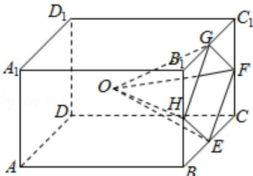

<!-- question-source:start -->
16. (5 分) 学生到工厂劳动实践, 利用 3D 打印技术制作模型. 如图, 该模型为长方体 $ABCD - A_1B_1C_1D_1$ 挖去四棱锥 $O - EFGH$ 后所得的几何体, 其中 $O$ 为长方体的中心, $E, F, G, H$ 分别为所在棱的中点, $AB = BC = 6cm$ , $AA_1 = 4cm.3D$ 打印所用原料密度为 $0.9g/cm^3$ . 不考虑打印损耗, 制作该模型所需原料的质量为 $\underline{\quad} g$ .

##
三、解答题: 共 70 分。
<!-- question-source:end -->

![[高中/真题/按年份分类/2019/2019年全国统一高考数学试卷_文科__新课标ⅲ__含解析版_/填空题/题目/answers/Q00028903A1.md]]
