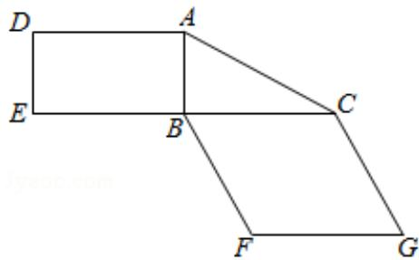
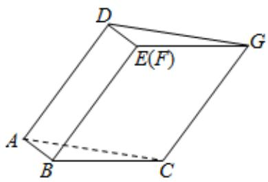

<!-- question-source:start -->
19. （12分）图1是由矩形 $ADEB$ ， $\mathrm{Rt}\triangle ABC$ 和菱形 $BFGC$ 组成的一个平面图形，其中 $AB = 1, BE = BF = 2, \angle FBC = 60^\circ$ 。将其沿 $AB, BC$ 折起使得 $BE$ 与 $BF$ 重合，连结 $DG$ ，如图2.

  
图1

  
图2
<!-- question-source:end -->

![[高中/真题/按年份分类/2019/2019年全国统一高考数学试卷_文科__新课标ⅲ__含解析版_/填空题/题目/answers/Q00028906A1.md]]
