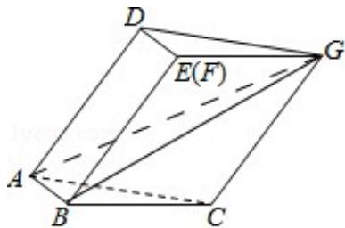

> [!faq]- 2019年全国统一高考数学试卷（文科）（新课标ⅲ）（含解析版）解析
>
> > [!success]- **【答案】** 详见解析
>
> > [!note]- **【分析】**
> > （1）运用空间线线平行的公理和确定平面的条件，以及线面垂直的判断和面面垂直的判定定理，即可得证；
> > (2) 连接 $BG, AG$ ，由线面垂直的性质和三角形的余弦定理和勾股定理，结合三角形的面积公式，可得所求值。
>
> > [!note]- **【解析】**
> > 解：
> > （1）证明：由已知可得 $AD \| BE$ ， $CG \| BE$ ，即有 $AD \| CG$
> >
> > 则 AD, CG 确定一个平面，从而 A, C, G, D 四点共面；
> >
> > 由四边形ABED为矩形，可得 $AB \perp BE$ ，
> >
> > 由 $\triangle ABC$ 为直角三角形，可得 $AB\perp BC$ ，
> >
> > 又 $BC \cap BE = E$ ，可得 $AB \perp$ 平面 BCGE，
> >
> > $ABC \subset$ 平面 $ABC$ ，可得平面 $ABC \perp$ 平面 $BCGE$ ;
> > (2) 连接 BG, AG,
> >
> > 由 $AB \perp$ 平面 BCGE，可得 $AB \perp BG$ ，
> >
> > 在 $\triangle BCG$ 中， $BC=CG=2$ ， $\angle BCG=120^{\circ}$ ，可得 $BG=2BC\sin60^{\circ}=2\sqrt{3}$ ，
> >
> > 可得 $AG = \sqrt{\mathrm{AB}^2 + \mathrm{BG}^2} = \sqrt{13}$
> >
> > 在 $\triangle ACG$ 中， $AC = \sqrt{5}$ ， $CG = 2$ ， $AG = \sqrt{13}$
> >
> > 可得 $\cos \angle ACG = \frac{4 + 5 - 13}{2\times 2\times\sqrt{5}} = -\frac{1}{\sqrt{5}}$ ，即有 $\sin \angle ACG = \frac{2}{\sqrt{5}}$
> >
> > 则平行四边形 $ACGD$ 的面积为 $2 \times \sqrt{5} \times \frac{2}{\sqrt{5}} = 4$ .
> >
> > 
> >
> > 【点评】本题考查空间线线、线面和面面的位置关系，考查平行和垂直的判断和性质，注意运用平面几何的性质，考查推理能力，属于中档题.
