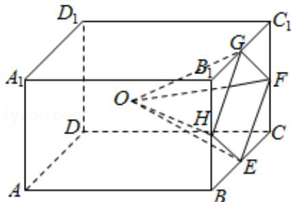

> [!faq]- 2019年全国统一高考数学试卷（文科）（新课标ⅲ）（含解析版）解析
>
> > [!success]- **【答案】** 为：118.8.  【点评】本题考查制作该模型所需原料的质量的求法，考查长方体、四棱锥的体积等基础知识，考查推理能力与计算能力，考查数形结合思想，属于中档题. ##
>
> > [!note]- **【分析】**
> > 该模型体积为 $V_{ABCD-A_{1}B_{1}C_{1}D_{1}} - V_{O-EFGH} = 6 \times 6 \times 4 -$
>
> > [!note]- **【解析】**
> > 分析】该模型体积为 $V_{ABCD-A_{1}B_{1}C_{1}D_{1}} - V_{O-EFGH} = 6 \times 6 \times 4 -$
> >
> > $\frac{1}{3} \times (4 \times 6 - 4 \times \frac{1}{2} \times 3 \times 2) \times 3 = 132$ ( $cm^3$ ), 再由 $3D$ 打印所用原料密度为 $0.9g/cm^3$ , 不考虑打印损耗, 能求出制作该模型所需原料的质量.
> >
> > 【
> > 解答】解：该模型为长方体 $ABCD - A_{1}B_{1}C_{1}D_{1}$ ，挖去四棱锥 $O - EFGH$ 后所得的几何体，其中 $O$ 为长方体的中心，
> >
> > E, F, G, H, 分别为所在棱的中点, AB = BC = 6cm, $AA_{1} = 4cm$ ,
> >
> > ∴该模型体积为：
> >
> > $$
> > V _ {A B C D - A _ {1} B _ {1} C _ {1} D _ {1}} - V _ {O - E F G H}
> > $$
> >
> > $$
> > = 6 \times 6 \times 4 - \frac {1}{3} \times (4 \times 6 - 4 \times \frac {1}{2} \times 3 \times 2) \times 3
> > $$
> >
> > $$
> > = 1 4 4 - 1 2 = 1 3 2 \left(c m ^ {3}\right)
> > $$
> >
> > ∵3D 打印所用原料密度为 $0.9g/cm^{3}$ ，不考虑打印损耗，
> >
> > ∴制作该模型所需原料的质量为： $132 \times 0.9 = 118.8$ （g）.
> >
> > 故
> > 答案为：118.8.
> >
> > 
> >
> > 【点评】本题考查制作该模型所需原料的质量的求法，考查长方体、四棱锥的体积等基础知识，考查推理能力与计算能力，考查数形结合思想，属于中档题.
> >
> > ##
