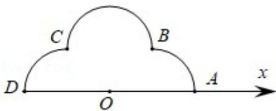

<!-- question-source:start -->
22. (10 分) 如图, 在极坐标系 $Ox$ 中, $A(2,0)$ , $B(\sqrt{2},\frac{\pi}{4})$ , $C(\sqrt{2},\frac{3\pi}{4})$ , $D(2,\pi)$ , 弧 $\widehat{AB}$ , $\widehat{BC}$ , $\widehat{CD}$ 所在圆的圆心分别是 $(1,0)$ , $(1,\frac{\pi}{2})$ , $(1,\pi)$ , 曲线 $M_1$ 是弧 $\widehat{AB}$ , 曲线 $M_2$ 是弧 $\widehat{BC}$ , 曲线 $M_3$ 是弧 $\widehat{CD}$ .

(1) 分别写出 $M_{1}$ ， $M_{2}$ ， $M_{3}$ 的极坐标方程；

(2) 曲线 M 由 $M_{1}$ ， $M_{2}$ ， $M_{3}$ 构成，若点 P 在 M 上，且 $|OP|=\sqrt{3}$ ，求 P 的极坐标.

## [选修 4-5：不等式选讲]（10 分）
<!-- question-source:end -->

![[高中/真题/按年份分类/2019/2019年全国统一高考数学试卷_文科__新课标ⅲ__含解析版_/解答题/题目/answers/Q00024173A1.md]]
