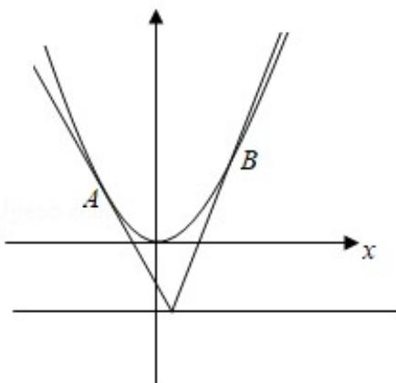

> [!faq]- 2019年全国统一高考数学试卷（文科）（新课标ⅲ）（含解析版）解析
>
> > [!success]- **【答案】** 详见解析
>
> > [!note]- **【分析】**
> > （1）设 $D\left(t, -\frac{1}{2}\right), A\left(x_1, y_1\right)$ ，则 $x_1^2 = 2y_1$ ，利用导数求斜率及两点求斜率可得 $2tx_1 - 2y_1 + 1 = 0$ ，设 $B\left(x_2, y_2\right)$ ，同理可得 $2tx_2 - 2y_2 + 1 = 0$ ，得到直线 $AB$ 的方程为 $2tx - 2y + 1 = 0$ ，再由直线系方程求直线 $AB$ 过的定点；
>
> > [!note]- **【解析】**
> > 分析】（1）设 $D\left(t, -\frac{1}{2}\right), A\left(x_1, y_1\right)$ ，则 $x_1^2 = 2y_1$ ，利用导数求斜率及两点求斜率可得 $2tx_1 - 2y_1 + 1 = 0$ ，设 $B\left(x_2, y_2\right)$ ，同理可得 $2tx_2 - 2y_2 + 1 = 0$ ，得到直线 $AB$ 的方程为 $2tx - 2y + 1 = 0$ ，再由直线系方程求直线 $AB$ 过的定点；
> >
> > (2) 由 (1) 得直线 $AB$ 的方程 $y = tx + \frac{1}{2}$ , 与抛物线方程联立, 利用中点坐标公式及根与系数的关系求得线段 $AB$ 的中点 $M(t, t^2 + \frac{1}{2})$ , 再由 $\overrightarrow{\mathsf{EM}} \perp \overrightarrow{\mathsf{AB}}$ , 可得关于 $t$ 的方程, 求得 $t = 0$ 或 $t = \pm 1$ . 然后分类求得 $|\overrightarrow{\mathsf{EM}}| = 2$ 及所求圆的方程.
> >
> > 【
> > 解答】（1）证明：设 $D(t, -\frac{1}{2})$ ， $A(x_1, y_1)$ ，则 $\mathbf{x}_1^2 = 2\mathbf{y}_1$
> >
> > 由于 $y' = x$ ，∴切线DA的斜率为 $x_1$ ，故 $\frac{y_1 + \frac{1}{2}}{x_1 - t} = x_1$ ，
> >
> > 整理得： $2tx_{1}-2y_{1}+1=0$ .
> >
> > 设 $B(x_{2}, y_{2})$ ，同理可得 $2tx_{2} - 2y_{2} + 1 = 0$ .
> >
> > 故直线 AB 的方程为 $2tx - 2y + 1 = 0$ .
> >
> > ∴直线AB过定点 $(0,\frac{1}{2})$ ;
> >
> > (2) 解：由（1）得直线 $AB$ 的方程 $y = tx + \frac{1}{2}$ .
> >
> > 由 $\left\{\begin{aligned}y=tx+\frac{1}{2}\\ y=\frac{x^{2}}{2}\end{aligned}\right.$ ，可得 $x^{2}-2tx-1=0$ .
> >
> > 于是 $x_{1}+x_{2}=2t,\quad y_{1}+y_{2}=t(x_{1}+x_{2})+1=2t^{2}+1.$
> >
> > 设 M 为线段 AB 的中点，则 $M(t, t^{2} + \frac{1}{2})$ ，
> >
> > 由于 $\overrightarrow{EM} \perp \overrightarrow{AB}$ ，而 $\overrightarrow{EM} = (t, t^2 - 2)$ ， $\overrightarrow{AB}$ 与向量（1， $t$ ）平行，
> >
> > $\therefore t + (t^2 - 2) t = 0$ ，解得 $t = 0$ 或 $t = \pm 1$ .
> >
> > 当 $t = 0$ 时， $\vert \overrightarrow{\mathbf{E}\mathbf{M}}\vert = 2$ ，所求圆的方程为 $\mathbf{x}^2 +(\mathbf{y}\frac{5}{2})^2 = 4;$
> >
> > 当 $t = \pm 1$ 时， $|\overrightarrow{E M}| = \sqrt{2}$ ，所求圆的方程为 $\mathbf{x}^2 + (\mathbf{y} - \frac{5}{2})^2 = 2$ .
> >
> > 
> >
> > 【点评】本题考查抛物线的简单性质, 考查直线与抛物线位置关系的应用, 考查计算能力, 是中档题.
> >
> > （二）选考题：共10分。请考生在第22、23题中任选一题作答。如果多做，则按所做的第一题计分。
> >
> > [选修 4-4：坐标系与参数方程]（10 分）
