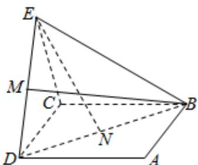

> [!faq]- 2019年全国统一高考数学试卷（文科）（新课标ⅲ）（含解析版）解析
>
> > [!success]- **【答案】** B
>
> > [!note]- **【分析】**
> > 推导出 BM 是 $\triangle BDE$ 中 DE 边上的中线，EN 是 $\triangle BDE$ 中 BD 边上的中线，从而直线 BM，EN 是相交直线，设 DE = a，则 $BD = \sqrt{2}a$ ， $BE = \sqrt{\frac{3}{4}a^{2} + \frac{5}{4}a^{2}} = \sqrt{2}a$ ，从而 BM = EN。
>
> > [!note]- **【解析】**
> > 解：∵点 N 为正方形 ABCD 的中心， $\triangle ECD$ 为正三角形，平面 $ECD \perp$ 平面 ABCD，M 是线段 ED 的中点，
> >
> > ∴BM⊂平面 BDE，EN⊂平面 BDE，
> >
> > ∵BM 是△BDE 中 DE 边上的中线，EN 是△BDE 中 BD 边上的中线，
> >
> > ∴直线 BM，EN 是相交直线，
> >
> > 设 $DE = a$ ，则 $BD = \sqrt{2} a$ ， $BE = \sqrt{\frac{3}{4}a^2 + \frac{5}{4}a^2} = \sqrt{2} a,$
> >
> > $\therefore BM = \frac{\sqrt{7}}{2} a, EN = \sqrt{\frac{3}{4} a^2 + \frac{1}{4} a^2} = a,$
> >
> > $\therefore BM=EN,$
> >
> > 故选：B.
> >
> > 
> >
> > 【点评】本题考查两直线的位置关系的判断，考查空间中线线、线面、面面间的位置关系等基础知识，考查推理能力与计算能力，是中档题.
