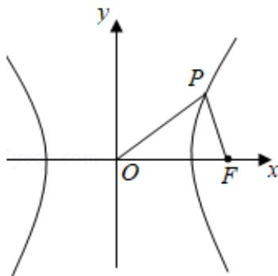

> [!faq]- 2019年全国统一高考数学试卷（文科）（新课标ⅲ）（含解析版）解析
>
> > [!success]- **【答案】** B
>
> > [!note]- **【分析】**
> > 由题意画出图形, 不妨设 F 为双曲线 $C: \frac{x^{2}}{4} - \frac{y^{2}}{5} = 1$ 的右焦点, P 为第一象限点,
> > 求出 P 点坐标，再由三角形面积公式求解.
> > 【
>
> > [!note]- **【解析】**
> > 解：如图，不妨设 F 为双曲线 $C: \frac{x^{2}}{4} - \frac{y^{2}}{5} = 1$ 的右焦点，P 为第一象限点.
> >
> > 
> >
> > 由双曲线方程可得， $a^2 = 4$ ， $b^{2} = 5$ ，则 $c = \sqrt{a^2 + b^2} = 3,$
> >
> > 则以 O 为圆心，以 3 为半径的圆的方程为 $x^{2}+y^{2}=9$ .
> >
> > 联立 $\left\{ \begin{array}{l} x^{2} + y^{2} = 9 \\ \frac{x^{2}}{4} - \frac{y^{2}}{5} = 1 \end{array} \right.$ ，解得 $P$ （ $\frac{2\sqrt{14}}{3}, \frac{5}{3}$ ）.
> >
> > $$
> > \therefore S _ {\triangle O P F} = \frac {1}{2} \times 3 \times \frac {5}{3} = \frac {5}{2}.
> > $$
> >
> > 故选：B.
> >
> > 【点评】本题考查双曲线的简单性质，考查数形结合的解题思想方法，是中档题.
