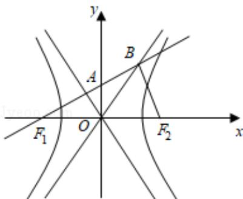

> [!faq]- 2019年全国统一高考数学试卷（理科）（新课标ⅰ）（含解析版）解析
>
> > [!success]- **【答案】** 为：2. 【点评】本题考查双曲线的简单性质, 考查数形结合的解题思想方法, 考查计算能力, 是中档题. ## 三、解答题：共70分。
>
> > [!note]- **【分析】**
> > 由题意画出图形, 结合已知可得 $F_{1}B \perp OA$ , 写出 $F_{1}B$ 的方程, 与 $y = \frac{b}{a}x$ 联立求得 B 点坐标, 再由斜边的中线等于斜边的一半求解.
>
> > [!note]- **【解析】**
> > 解：如图，
> >
> > 
> >
> > $\because \overrightarrow{\mathrm{F}_{1}\mathrm{A}} = \overrightarrow{\mathrm{AB}}$ ，且 $\overrightarrow{\mathrm{F}_1\mathrm{B}}\cdot \overrightarrow{\mathrm{F}_2\mathrm{B}} = 0,\therefore OA\bot F_1B,$
> >
> > 则 $F_{1}B: y = \frac{a}{b} (x + c)$ ,
> >
> > 联立 $\left\{\begin{aligned}y=\frac{a}{b}(x+c)\\ y=\frac{b}{a}x\end{aligned}\right.$ ，解得B $\left(\frac{a^{2}c}{b^{2}-a^{2}},\frac{abc}{b^{2}-a^{2}}\right)$ ，
> >
> > 则 $OB^{2} = \frac{a^{4}c^{2}}{(b^{2} - a^{2})^{2}} +\frac{a^{2}b^{2}c^{2}}{(b^{2} - a^{2})^{2}} = c^{2},$
> >
> > 整理得： $b^{2}=3a^{2}$ ，∴ $c^{2}-a^{2}=3a^{2}$ ，即 $4a^{2}=c^{2}$ ，
> >
> > $$
> > \therefore \frac {c ^ {2}}{a ^ {2}} = 4, e = \frac {c}{a} = 2.
> > $$
> >
> > 故
