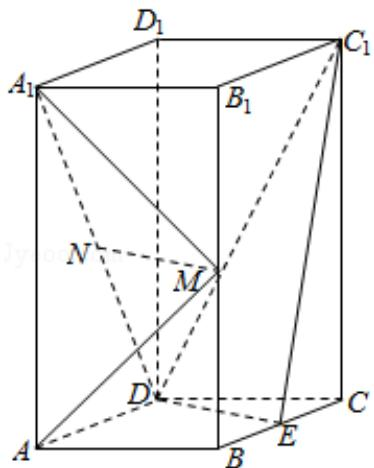

<!-- question-source:start -->
18. （12分）如图，直四棱柱 $ABCD - A_{1}B_{1}C_{1}D_{1}$ 的底面是菱形， $AA_{1} = 4$ ， $AB = 2$ ， $\angle BAD = 60^{\circ}$ ， $E$ ， $M$ ， $N$ 分别是 $BC$ ， $BB_{1}$ ， $A_{1}D$ 的中点.

(1) 证明: $MN \parallel$ 平面 $C_{1} D E$ ;

(2) 求二面角 $A - MA_{1} - N$ 的正弦值.

<!-- question-source:end -->

![[高中/真题/按年份分类/2019/2019年全国统一高考数学试卷_理科__新课标ⅰ__含解析版_/解答题/题目/answers/Q00024495A1.md]]
