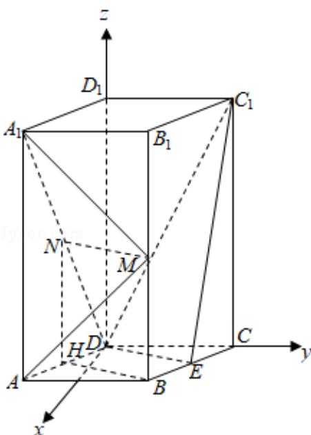

> [!faq]- 2019年全国统一高考数学试卷（理科）（新课标ⅰ）（含解析版）解析
>
> > [!success]- **【答案】** 详见解析
>
> > [!note]- **【分析】**
> > （1）过 N 作 $NH \perp AD$ ，证明 $NM \| BH$ ，再证明 $BH \| DE$ ，可得 $NM \| DE$ ，再由线面平行的判定可得 $MN \|$ 平面 $C_{1}DE$ ；
> > (2) 以 $D$ 为坐标原点, 以垂直于 $DC$ 得直线为 $x$ 轴, 以 $DC$ 所在直线为 $y$ 轴, 以 $DD_{1}$ 所在直线为 $z$ 轴建立空间直角坐标系, 分别求出平面 $A_{1}MN$ 与平面 $MAA_{1}$ 的一个法向量, 由两法向量所成角的余弦值可得二面角 $A - MA_{1} - N$ 的正弦值.
>
> > [!note]- **【解析】**
> > （1）证明：如图，过 N 作 $NH \perp AD$ ，则 $NH \parallel AA_{1}$ ，且 $NH = \frac{1}{2} AA_{1}$ ，
> >
> > 又 $MB\| AA_1$ ， $MB = \frac{1}{2}\mathbb{A}\mathbb{A}_1$ ，∴四边形NMBH为平行四边形，则 $NM\| BH$
> >
> > 由 $NH\| AA_1$ ， $N$ 为 $A_{1}D$ 中点，得 $H$ 为 $AD$ 中点，而 $E$ 为 $BC$ 中点，
> >
> > $\therefore BE \parallel DH, BE = DH$ ，则四边形 $BEDH$ 为平行四边形，则 $BH \parallel DE$ ，
> >
> > $\therefore NM\|DE,$
> >
> > ∵NM∉平面 $C_{1}DE$ ，DE⊂平面 $C_{1}DE$ ，
> >
> > $\therefore MN\|$ 平面 $C_{1}DE;$
> > (2) 解: 以 $D$ 为坐标原点, 以垂直于 $DC$ 得直线为 $x$ 轴, 以 $DC$ 所在直线为 $y$ 轴, 以 $DD_{1}$ 所在直线为 $z$ 轴建立空间直角坐标系,
> >
> > 则 $N\left(\frac{\sqrt{3}}{2}, - \frac{1}{2}, 2\right)$ ， $M\left(\sqrt{3}, 1, 2\right)$ ， $A_{1}\left(\sqrt{3}, -1, 4\right)$
> >
> > $\overrightarrow{\mathrm{NM}} = \left(\frac{\sqrt{3}}{2}, \frac{3}{2}, 0\right), \overrightarrow{\mathrm{NA}_1} = \left(\frac{\sqrt{3}}{2}, -\frac{1}{2}, 2\right)$ ,
> >
> > 设平面 $A_{1}MN$ 的一个法向量为 $\vec{\pi} = (x, y, z)$ ,
> >
> > 由 $\left\{\begin{aligned}\overrightarrow{m}\cdot\overrightarrow{NM}=\frac{\sqrt{3}}{2}x+\frac{3}{2}y=0\\ \overrightarrow{m}\cdot\overrightarrow{NA_{1}}=\frac{\sqrt{3}}{2}x-\frac{1}{2}y+2z=0\end{aligned}\right.$ ，取 $x=\sqrt{3}$ ，得 $\overrightarrow{m}=(\sqrt{3},-1,-1)$ ，
> >
> > 又平面 $MAA_{1}$ 的一个法向量为 $\vec{n}=(1,0,0)$ ,
> >
> > $$
> > \therefore \cos <   \vec {m}, \vec {n} > = \frac {\vec {m} \cdot \vec {n}}{| \vec {m} | \cdot | \vec {n} |} = \frac {\sqrt {3}}{\sqrt {5}} = \frac {\sqrt {1 5}}{5}.
> > $$
> >
> > ∴二面角 $A - MA_{1} - N$ 的正弦值为 $\frac{\sqrt{10}}{5}$ .
> >
> > 
> >
> > 【点评】本题考查直线与平面平行的判定，考查空间想象能力与思维能力，训练了利用空间向量求解空间角，是中档题.
