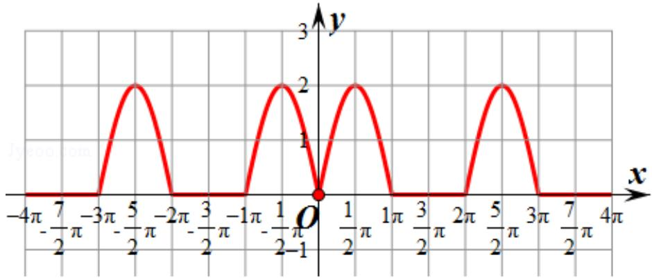

> [!faq]- 2019年全国统一高考数学试卷（理科）（新课标ⅰ）（含解析版）解析
>
> > [!success]- **【答案】** C
>
> > [!note]- **【分析】**
> > 根据绝对值的应用，结合三角函数的图象和性质分别进行判断即可.
>
> > [!note]- **【解析】**
> > 解: $f(-x) = \sin | - x| + |\sin (-x)| = \sin |x| + |\sin x| = f(x)$ 则函数 $f(x)$ 是偶函数, 故①正确,
> >
> > 当 $x \in \left(\frac{\pi}{2}, \pi\right)$ 时， $\sin |x| = \sin x, |\sin x| = \sin x,$
> >
> > 则 $f(x) = \sin x + \sin x = 2\sin x$ 为减函数，故②错误，
> >
> > 当 $0 \leq x \leq \pi$ 时， $f(x) = \sin |x| + |\sin x| = \sin x + \sin x = 2\sin x,$
> >
> > 由 $f(x) = 0$ 得 $2\sin x = 0$ 得 $x = 0$ 或 $x = \pi$
> >
> > 由 $f(x)$ 是偶函数，得在 $[- \pi, \pi)$ 上还有一个零点 $x = -\pi$ ，即函数 $f(x)$ 在 $[- \pi, \pi]$ 有3个零点，故③错误，
> >
> > 当 $\sin|x|=1,\quad|\sin x|=1$ 时， $f(x)$ 取得最大值 2，故④正确，
> >
> > 故正确是①④，
> >
> > 故选：C.
> >
> > 
> >
> > 【点评】本题主要考查与三角函数有关的命题的真假判断，结合绝对值的应用以及利用三角函数的性质是解决本题的关键.
