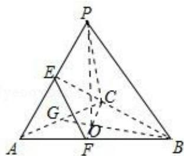

> [!faq]- 2019年全国统一高考数学试卷（理科）（新课标ⅰ）（含解析版）解析
>
> > [!success]- **【答案】** D
>
> > [!note]- **【分析】**
> > 由题意画出图形, 证明三棱锥 P-ABC 为正三棱锥, 且三条侧棱两两互相垂直, 再由补形法求外接球球 O 的体积.
>
> > [!note]- **【解析】**
> > 分析】由题意画出图形, 证明三棱锥 P-ABC 为正三棱锥, 且三条侧棱两两互相垂直, 再由补形法求外接球球 O 的体积.
> >
> > 【
> > 解答】解：如图，
> >
> > 
> >
> > 由 PA=PB=PC， $\triangle ABC$ 是边长为 2 的正三角形，可知三棱锥 P-ABC 为正三棱锥，
> >
> > 则顶点 P 在底面的射影 O 为底面三角形的中心，连接 BO 并延长，交 AC 于 G，
> >
> > 则 $AC \perp BG$ ，又 $PO \perp AC$ ， $PO \cap BG = O$ ，可得 $AC \perp$ 平面 $PBG$ ，则 $PB \perp AC$ ，
> >
> > ∵E，F分别是PA，AB的中点，∴EF∥PB，
> >
> > 又 $\angle CEF=90^{\circ}$ ，即 $EF\perp CE$ ， $\therefore PB\perp CE$ ，得 $PB\perp$ 平面 $PAC$ ，
> >
> > ∴正三棱锥 P - ABC 的三条侧棱两两互相垂直，
> >
> > 把三棱锥补形为正方体，则正方体外接球即为三棱锥的外接球，
> >
> > 其直径为 $D=\sqrt{PA^{2}+PB^{2}+PC^{2}}=\sqrt{6}$ .
> >
> > 半径为 $\frac{\sqrt{6}}{2}$ ，则球 $O$ 的体积为 $\frac{4}{3} \pi \times \left(\frac{\sqrt{6}}{2}\right)^3 = \sqrt{6} \pi$ .
> >
> > 故选：D.
> >
> > 【点评】本题考查多面体外接球体积的求法，考查空间想象能力与思维能力，考查计算能力，是中档题.
> >
> > ##
> > 二、填空题：本题共4小题，每小题5分，共20分。
