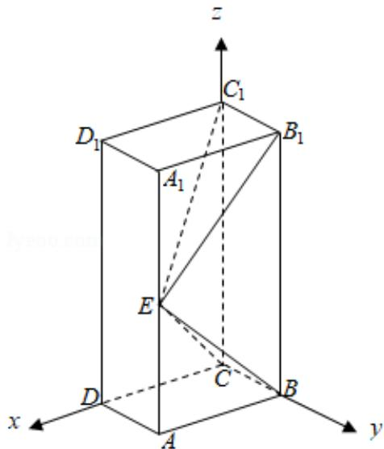

> [!faq]- 2019年全国统一高考数学试卷（理科）（新课标ⅱ）（含解析版）解析
>
> > [!success]- **【答案】** ～21 题为必考题, 每个试题考生都必须作答。第
>
> > [!note]- **【分析】**
> > （1）推导出 $B_{1}C_{1} \perp BE$ ， $BE \perp EC_{1}$ ，由此能证明 $BE \perp$ 平面 $EB_{1}C_{1}$
> > (2) 以 C 为坐标原点, 建立如图所示的空间直角坐标系, 利用向量法能求出二面角 B - EC - $C_{1}$ 的正弦值.
>
> > [!note]- **【解析】**
> > 证明：
> > （1）长方体 $ABCD - A_{1}B_{1}C_{1}D_{1}$ 中， $B_{1}C_{1} \perp$ 平面 $ABA_{1}B_{1}$ ，
> >
> > $$
> > \therefore B _ {1} C _ {1} \bot B E, \because B E \bot E C _ {1}
> > $$
> >
> > $\therefore BE \perp$ 平面 $EB_{1}C_{1}$ .
> >
> > 解：
> > （2）以 C 为坐标原点，建立如图所示的空间直角坐标系，
> >
> > 设 $AE=A_{1}E=1$ ，∵ $BE \perp$ 平面 $EB_{1}C_{1}$ ，∴ $BE \perp EB_{1}$ ，∴ AB=1，
> >
> > 则 $E(1, 1, 1)$ ， $A(1, 1, 0)$ ， $B_1(0, 1, 2)$ ， $C_1(0, 0, 2)$ ， $C(0, 0, 0)$ ， $\because BC \perp EB_1$ ， $\therefore EB_1 \perp$ 面 $EBC$ ，
> >
> > 故取平面 EBC 的法向量为 $\vec{\pi}=\overrightarrow{EB_{1}}=(-1,0,1)$ ，
> >
> > 设平面 $ECC_{1}$ 的法向量 $\vec{n}=(x,y,z)$ ，
> >
> > 由 $\left\{\begin{aligned}\overrightarrow{n}&\cdot\overrightarrow{CC_{1}}=0\\\overrightarrow{n}&\cdot\overrightarrow{CE}=0\end{aligned}\right.$ ，得 $\left\{\begin{aligned}z&=0\\ x+y+z&=0\end{aligned}\right.$ ，取x=1，得 $\overrightarrow{n}=(1,-1,0)$ ，
> >
> > $$
> > \therefore \cos <   \vec {m}, \vec {n} > = \frac {\vec {m} \cdot \vec {n}}{| \vec {m} | \cdot | \vec {n} |} = - \frac {1}{2},
> > $$
> >
> > ∴二面角 $B - EC - C_{1}$ 的正弦值为 $\frac{\sqrt{3}}{2}$ .
> >
> > 
