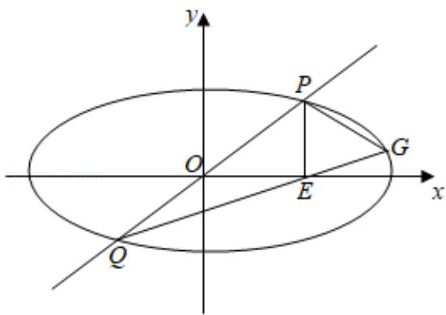

> [!faq]- 2019年全国统一高考数学试卷（理科）（新课标ⅱ）（含解析版）解析
>
> > [!success]- **【答案】** 详见解析
>
> > [!note]- **【分析】**
> > （1）利用直接法不难得到方程；
>
> > [!note]- **【解析】**
> > 分析】（1）利用直接法不难得到方程；
> >
> > (2) (i) 设 $P(x_0, y_0)$ ，则 $Q(-x_0, -y_0), E(x_0, 0)$ ，利用直线 $QE$ 的方程与椭圆方程联立求得 $G$ 点坐标，去证 $PQ$ ， $PG$ 斜率之积为 $-1$ ；
> >
> > (ii) 利用 $S=\frac{1}{2}\left|PE\right|\times\left(x_{G}+x_{0}\right)$ ，代入已得数据，并对 $\frac{x_{0}}{y_{0}}+\frac{y_{0}}{x_{0}}$ 换元，利用“对号”函数可得最值.
> >
> > 【
> > 解答】解：（1）由题意得 $\frac{y}{x+2}\times\frac{y}{x-2}=-\frac{1}{2}$
> >
> > 整理得曲线 $C$ 的方程： $\frac{x^2}{4} +\frac{y^2}{2} = 1(y\neq 0)$
> >
> > ∴曲线 C 是焦点在 x 轴上不含长轴端点的椭圆；
> >
> > 
> >
> > (2)
> >
> > (i) 设 $P(x_{0}, y_{0})$ ，则 $Q(-x_{0}, -y_{0})$ ， $E(x_{0}, 0)$ , $G(x_{G}, y_{G})$ ,
> >
> > ∴直线 QE 的方程为： $y=\frac{y_{0}}{2x_{0}}(x-x_{0})$ ,
> >
> > 与 $\frac{x^2}{4} +\frac{y^2}{2} = 1$ 联立消去 $y$
> >
> > 得 $(2x_0^2 + y_0^2)x^2 - 2x_0y_0^2x + x_0^2y_0^2 - 8x_0^2 = 0,$
> >
> > $$
> > \therefore - x _ {0} x _ {G} = \frac {x _ {0} ^ {2} y _ {0} ^ {2} - 8 x _ {0} ^ {2}}{2 x _ {0} ^ {2} + y _ {0} ^ {2}},
> > $$
> >
> > $$
> > \therefore \mathrm{x} _ {G} = \frac {\left(8 - \mathrm{y} _ {0} ^ {2}\right) \mathrm{x} _ {0}}{2 \mathrm{x} _ {0} ^ {2} + \mathrm{y} _ {0} ^ {2}},
> > $$
> >
> > $$
> > \therefore y _ {G} = \frac {y _ {0}}{2 x _ {0}} (x _ {G} - x _ {0}) = \frac {y _ {0} (4 - x _ {0} ^ {2} - y _ {0} ^ {2})}{2 x _ {0} ^ {2} + y _ {0} ^ {2}},
> > $$
> >
> > $$
> > \therefore k _ {P G} = \frac {y _ {G} - y _ {0}}{x _ {G} - x _ {0}}
> > $$
> >
> > $$
> > = \frac {\frac {y _ {0} (4 - x _ {0} ^ {2} - y _ {0} ^ {2})}{2 x _ {0} ^ {2} + y _ {0} ^ {2}} - y _ {0}}{\frac {x _ {0} (8 - y _ {0} ^ {2})}{2 x _ {0} ^ {2} + y _ {0} ^ {2}} - x _ {0}}
> > $$
> >
> > $$
> > \begin{array}{l} = \frac {4 y _ {0} - y _ {0} x _ {0} ^ {2} - y _ {0} ^ {3} - 2 y _ {0} x _ {0} ^ {2} - y _ {0} ^ {3}}{8 x _ {0} - x _ {0} y _ {0} ^ {2} - 2 x _ {0} ^ {3} - x _ {0} y _ {0} ^ {2}} \\ = \frac {y _ {0} (4 - 3 x _ {0} ^ {2} - 2 y _ {0} ^ {2})}{2 x _ {0} (4 - y _ {0} ^ {2} - x _ {0} ^ {2})}, \end{array}
> > $$
> >
> > 把 $\mathbf{x}_0^2 + 2\mathbf{y}_0^2 = 4$ 代入上式，
> >
> > $$
> > \begin{array}{r l} & {\text {得} k _ {P G} = \frac {y _ {0} (4 - 3 x _ {0} ^ {2} - 4 + x _ {0} ^ {2})}{2 x _ {0} (4 - y _ {0} ^ {2} - 4 + 2 y _ {0} ^ {2})}} \\ & {\qquad = \frac {- y _ {0} \times 2 x _ {0} ^ {2}}{2 x _ {0} y _ {0} ^ {2}}} \\ & {\qquad = - \frac {x _ {0}}{y _ {0}},} \end{array}
> > $$
> >
> > $$
> > \therefore k _ {P Q} \times k _ {P G} = \frac {\mathbf {y} _ {0}}{\mathbf {x} _ {0}} \times (- \frac {\mathbf {x} _ {0}}{\mathbf {y} _ {0}}) = - 1,
> > $$
> >
> > $\therefore PQ \perp PG,$
> >
> > 故 $\triangle PQG$ 为直角三角形；
> >
> > $$
> > \begin{array}{r l} & {(i i) S _ {\triangle P Q G} = \frac {1}{2} | \mathrm{PE} | \times (\mathbf {x} _ {G} - \mathbf {x} _ {Q})} \\ & {= \frac {1}{2} y _ {0} (\mathbf {x} _ {G} + \mathbf {x} _ {0})} \\ & {= \frac {1}{2} y _ {0} [ \frac {(8 - y _ {0} ^ {2}) x _ {0}}{2 x _ {0} ^ {2} + y _ {0} ^ {2}} + x _ {0} ]} \\ & {= \frac {1}{2} y _ {0} x _ {0} \times \frac {8 - y _ {0} ^ {2} + 2 x _ {0} ^ {2} + y _ {0} ^ {2}}{2 x _ {0} ^ {2} + y _ {0} ^ {2}}} \\ & {= \frac {y _ {0} x _ {0} (4 + x _ {0} ^ {2})}{2 x _ {0} ^ {2} + y _ {0} ^ {2}}} \end{array}
> > $$
> >
> > $$
> > \begin{array}{l} = \frac {y _ {0} x _ {0} (x _ {0} ^ {2} + 2 y _ {0} ^ {2} + x _ {0} ^ {2})}{2 x _ {0} ^ {2} + y _ {0} ^ {2}} \\ = \frac {2 y _ {0} x _ {0} (x _ {0} ^ {2} + y _ {0} ^ {2})}{2 x _ {0} ^ {2} + y _ {0} ^ {2}} \\ = \frac {8 y _ {0} x _ {0} (x _ {0} ^ {2} + y _ {0} ^ {2})}{(2 x _ {0} ^ {2} + y _ {0} ^ {2}) (x _ {0} ^ {2} + 2 y _ {0} ^ {2})} \\ = \frac {8 (y _ {0} x _ {0} ^ {3} + x _ {0} y _ {0} ^ {3})}{2 x _ {0} ^ {4} + 2 y _ {0} ^ {4} + 5 x _ {0} ^ {2} y _ {0} ^ {2}} \\ = \frac {8 (\frac {x _ {0}}{y _ {0}} + \frac {y _ {0}}{x _ {0}})}{2 (\frac {x _ {0}}{y _ {0}} + \frac {y _ {0}}{x _ {0}}) ^ {2} + 1} \end{array}
> > $$
> >
> > 令 $t = \frac{x_0}{y_0} +\frac{y_0}{x_0}$ ，则 $t\geq 2$
> >
> > $$
> > S _ {\triangle P Q G} = \frac {8 t}{2 t ^ {2} + 1} = \frac {8}{2 t + \frac {1}{t}}
> > $$
> >
> > 利用“对号”函数 $f(t) = 2t + \frac{1}{t}$ 在 $[2, +\infty)$ 的单调性可知，
> >
> > $f(t) \geqslant 4 + \frac{1}{2} = \frac{9}{2}$ （ $t = 2$ 时取等号），
> >
> > $\therefore S_{\triangle PQG} \leqslant \frac{8}{\frac{9}{2}} = \frac{16}{9}$ （此时 $x_0 = y_0 = \frac{2\sqrt{3}}{3}$ ）
> >
> > 故 $\triangle PQG$ 面积的最大值为 $\frac{16}{9}$ .
> >
> > 【点评】此题考查了直接法求曲线方程, 直线与椭圆的综合, 换元法等, 对运算能力考查尤为突出, 难度大.
> >
> > （二）选考题：共10分。请考生在第22、23题中任选一题作答。如果多做，则按所做的第一题计分。
> >
> > ## [选修 4-4：坐标系与参数方程]（10 分）
