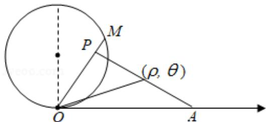

> [!faq]- 2019年全国统一高考数学试卷（理科）（新课标ⅱ）（含解析版）解析
>
> > [!success]- **【答案】** . 【
>
> > [!note]- **【分析】**
> > （1）把 $\theta_0 = \frac{\pi}{3}$ 直接代入 $\rho = 4\sin \theta$ 即可求得 $\rho_0$ ，在直线 $l$ 上任取一点 $(\rho, \theta)$ ，利用三角形中点边角关系即可求得 $l$ 的极坐标方程；
> > (2) 设 $P(\rho, \theta)$ ，在 Rt△OAP 中，根据边与角的关系得
>
> > [!note]- **【解析】**
> > 解：
> > （1）当 $\theta_0 = \frac{\pi}{3}$ 时， $\rho_0 = 4\sin \frac{\pi}{3} = 2\sqrt{3}$ ，
> >
> > 在直线 l 上任取一点 $(\rho, \theta)$ ，则有 $\rho \cos(\theta - \frac{\pi}{3}) = 2$ ，
> >
> > 故 $l$ 的极坐标方程为有 $\rho \cos (\theta -\frac{\pi}{3}) = 2;$
> > (2) 设 $P(\rho, \theta)$ ，则在 Rt△OAP 中，有 $\rho = 4\cos \theta$
> >
> > $\because P$ 在线段 $OM$ 上， $\therefore \theta \in [\frac{\pi}{4},\frac{\pi}{2} ]$
> >
> > 故 $P$ 点轨迹的极坐标方程为 $\rho = 4\cos \theta$ ， $\theta \in [\frac{\pi}{4},\frac{\pi}{2} ]$
> >
> > 
> >
> > 【点评】本题考查解得曲线的极坐标方程及其应用，画图能够起到事半功倍的作用，是基础题.
> >
> > ## [选修 4-5：不等式选讲]（10 分）
