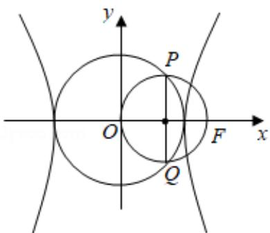

> [!faq]- 2019年全国统一高考数学试卷（理科）（新课标ⅱ）（含解析版）解析
>
> > [!success]- **【答案】** A
>
> > [!note]- **【分析】**
> > 由题意画出图形，先求出 PQ，再由 $|PQ| = |OF|$ 列式求 C 的离心率.
>
> > [!note]- **【解析】**
> > 解：如图，
> >
> > 
> >
> > 由题意，把 $x = \frac{c}{2}$ 代入 $x^{2} + y^{2} = a^{2}$ ，得 $PQ = 2\sqrt{a^2 - \frac{c^2}{4}}$
> >
> > 再由 $|PQ|=|OF|$ ，得 $2\sqrt{a^{2}-\frac{c^{2}}{4}}=c$ ，即 $2a^{2}=c^{2}$ ，
> >
> > $\therefore \frac{c^2}{a^2} = 2$ ，解得 $e = \frac{c}{a} = \sqrt{2}$
> >
> > 故选：A.
