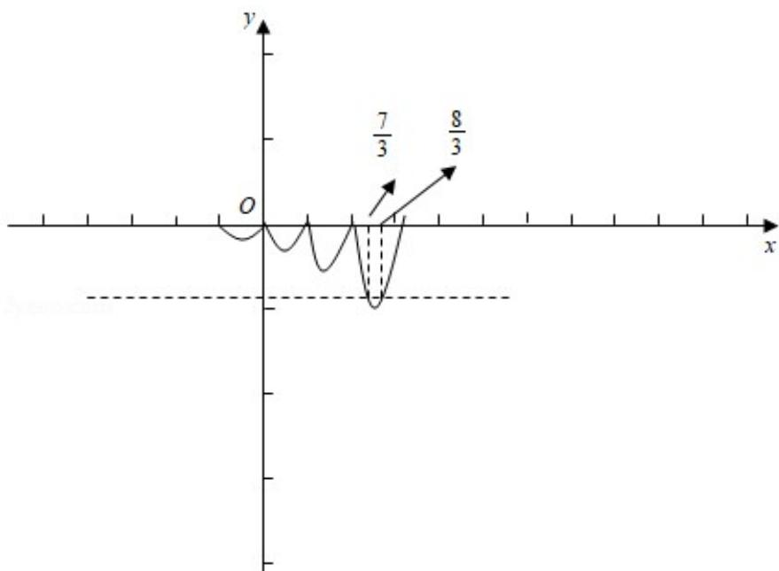

> [!faq]- 2019年全国统一高考数学试卷（理科）（新课标ⅱ）（含解析版）解析
>
> > [!success]- **【答案】** B
>
> > [!note]- **【分析】**
> > 因为 $f(x+1)=2f(x)$ ，∴ $f(x)=2f(x-1)$ ，分段求解析式，结合图象可得.
>
> > [!note]- **【解析】**
> > 解：因为 $f(x+1)=2f(x)$ ，∴ $f(x)=2f(x-1)$ ，
> >
> > 
> >
> > $\because x \in (0, 1]$ 时， $f(x) = x (x - 1) \in [-\frac{1}{4}, 0]$ ，
> >
> > $\therefore x \in (1, 2]$ 时， $x - 1 \in (0, 1]$ ， $f(x) = 2f(x - 1) = 2(x - 1) \quad (x - 2) \in [-\frac{1}{2}, 0]$ ;
> >
> > $\therefore x \in (2, 3]$ 时， $x - 1 \in (1, 2]$ ， $f(x) = 2f(x - 1) = 4(x - 2) \quad (x - 3) \in [-1, 0]$ ，
> >
> > 当 $x \in (2, 3]$ 时，由4 $(x - 2)$ $(x - 3) = -\frac{8}{9}$ 解得 $x = \frac{7}{3}$ 或 $x = \frac{8}{3}$ ，
> >
> > 若对任意 $x \in (-\infty, m]$ ，都有 $f(x) \geqslant -\frac{8}{9}$ ，则 $m \leq \frac{7}{3}$ .
> >
> > 故选：B.
> >
> > 【点评】本题考查了函数与方程的综合运用，属中档题.
> >
> > ##
> > 二、填空题：本题共4小题，每小题5分，共20分。
