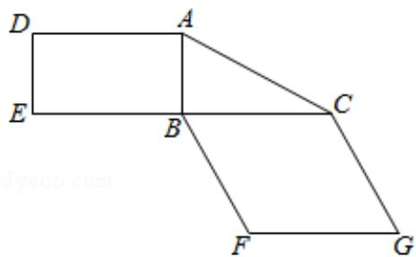
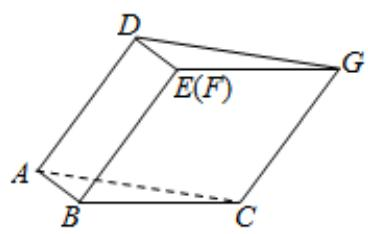

<!-- question-source:start -->
19. 图 1 是由矩形 ADEB、Rt△ABC 和菱形 BFGC 组成的一个平面图形, 其中 AB=1, BE=BF =2, ∠FBC=60°. 将其沿 AB, BC 折起使得 BE 与 BF 重合, 连结 DG, 如图 2.

  
图1

  
图2

(1) 证明: 图2中的A, C, G, D四点共面, 且平面ABC⊥平面BCGE;

(2) 求图 2 中的二面角 B - CG - A 的大小.
<!-- question-source:end -->

![[高中/真题/按年份分类/2019/2019年全国统一高考数学试卷_理科__新课标ⅲ__含解析版_/填空题/题目/answers/Q00026903A1.md]]
