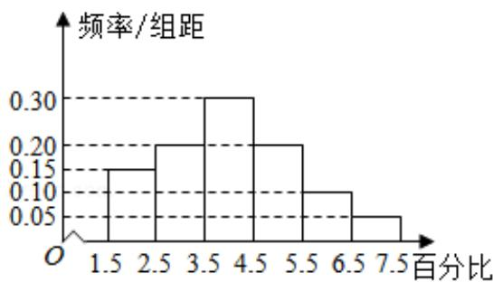
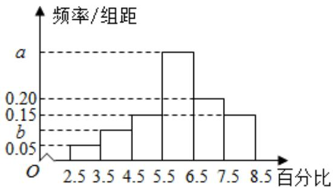

<!-- question-source:start -->
17. 为了解甲、乙两种离子在小鼠体内的残留程度，进行如下试验：将200只小鼠随机分成A、B两组，每组100只，其中A组小鼠给服甲离子溶液，B组小鼠给服乙离子溶液。每只小鼠给服的溶液体积相同、摩尔浓度相同。经过一段时间后用某种科学方法测算出残留在小鼠体内离子的百分比。根据试验数据分别得到如图直方图：

  
甲离子残留百分比直方图

  
乙离子残留百分比直方图

记 C 为事件：“乙离子残留在体内的百分比不低于 5.5”，根据直方图得到 $P(C)$ 的估计值为 0.70.

(1) 求乙离子残留百分比直方图中 $a, b$ 的值;

(2) 分别估计甲、乙离子残留百分比的平均值（同一组中的数据用该组区间的中点值为代表）.

18. $\triangle ABC$ 的内角 $A$ 、 $B$ 、 $C$ 的对边分别为 $a, b, c$ . 已知 $a \sin \frac{A + C}{2} = b \sin A$ .

(1) 求 B;

(2) 若 $\triangle ABC$ 为锐角三角形，且 $c = 1$ ，求 $\triangle ABC$ 面积的取值范围.
<!-- question-source:end -->

![[高中/真题/按年份分类/2019/2019年全国统一高考数学试卷_理科__新课标ⅲ__含解析版_/解答题/题目/answers/Q00026902A1.md]]
