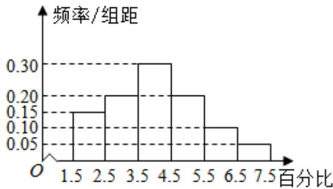
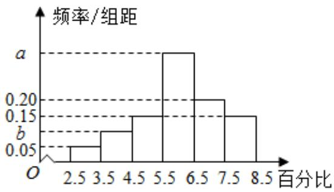

<!-- question-source:start -->
18. 
甲离子残留百分比直方图

  
乙离子残留百分比直方图

记 $C$ 为事件：“乙离子残留在体内的百分比不低于5.5”，根据直方图得到 $P(C)$ 的估计值为0.70.

(1) 求乙离子残留百分比直方图中 $a, b$ 的值；

(2) 分别估计甲、乙离子残留百分比的平均值（同一组中的数据用该组区间的中点值为代表）.

【
<!-- question-source:end -->

![[高中/真题/按年份分类/2019/2019年全国统一高考数学试卷_理科__新课标ⅲ__含解析版_/解答题/题目/answers/Q00026908A1.md]]
