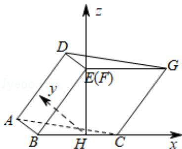

> [!faq]- 2019年全国统一高考数学试卷（理科）（新课标ⅲ）（含解析版）解析
>
> > [!success]- **【答案】** 详见解析
>
> > [!note]- **【分析】**
> > (1) 推导出 $AD \parallel BE, CG \parallel BE$ ，从而 $AD \parallel CG$ ，由此能证明 A, C, G, D 四点共面，推导出 $AB \perp BE, AB \perp BC$ ，从而 $AB \perp$ 面 BCGE，由此能证明平面 $ABC \perp$ 平面 BCGE.
>
> > [!note]- **【解析】**
> > 分析】(1) 推导出 $AD \parallel BE, CG \parallel BE$ ，从而 $AD \parallel CG$ ，由此能证明 A, C, G, D 四点共面，推导出 $AB \perp BE, AB \perp BC$ ，从而 $AB \perp$ 面 BCGE，由此能证明平面 $ABC \perp$ 平面 BCGE.
> >
> > (2) 作 $EH \perp BC$ , 垂足为 $H$ , 以 $H$ 为坐标原点, $\overrightarrow{HC}$ 的方向为 $x$ 轴正方向, 建立空间直角坐标系 $H - xyz$ , 运用空间向量方法求二面角 $B - CG - A$ 的大小.
> >
> > 【
> > 解答】证明：（1）由已知得 $AD \parallel BE$ ， $CG \parallel BE$ ， $\therefore AD \parallel CG$ ，
> >
> > ∴AD，CG确定一个平面，
> >
> > $\therefore A, C, G, D$ 四点共面，
> >
> > 由已知得 $AB \perp BE$ ， $AB \perp BC$ ，∴ $AB \perp$ 面 BCGE，
> >
> > ∵ABC⊂平面ABC，∴平面ABC⊥平面BCGE.
> >
> > 解：（2）作 $EH \perp BC$ ，垂足为 $H$ ，
> >
> > ∵EH⊂平面BCGE，平面BCGE⊥平面ABC，
> >
> > $\therefore EH \perp$ 平面 ABC,
> >
> > 由已知，菱形 BCGE 的边长为 2， $\angle EBC=60^{\circ}$ ，
> >
> > $$
> > \therefore B H = 1, E H = \sqrt {3},
> > $$
> >
> > 以 $H$ 为坐标原点， $\overrightarrow{\mathrm{HC}}$ 的方向为 $x$ 轴正方向，建立如图所求的空间直角坐标系 $H - xyz$ 则 $A(-1, 1, 0)$ ， $C(1, 0, 0)$ ， $G(2, 0, \sqrt{3})$ ，
> >
> > $$
> > \overrightarrow {C G} = (1, 0, \sqrt {3}), \overrightarrow {A C} = (2, - 1, 0)
> > $$
> >
> > 设平面 ACGD 的法向量 $\vec{n} = (x, y, z)$ ，
> >
> > 则 $\left\{ \begin{array}{l} \overrightarrow{CG} \cdot \overrightarrow{n} = x + \sqrt{3} z = 0 \\ \overrightarrow{AC} \cdot \overrightarrow{n} = 2x - y = 0 \end{array} \right.$ ，取 $x = 3$ ，得 $\overrightarrow{n} = (3, 6, -\sqrt{3})$ ，
> >
> > 又平面 BCGE 的法向量为 $\vec{\pi} = (0, 1, 0)$ ，
> >
> > $$
> > \therefore \cos <   \vec {n}, \quad \vec {\pi} > = \frac {\vec {n} \cdot \vec {m}}{| \vec {n} | \cdot | \vec {m} |} = \frac {\sqrt {3}}{2},
> > $$
> >
> > ∴二面角 B - CG - A 的大小为 $30^{\circ}$ .
> >
> > 
> >
> > 【点评】本题考查线面垂直的证明，考查二面角的正弦值的求法，考查空间中线线、线面、
> > 面面间的位置关系等基础知识，考查推理能力与计算能力，是中档题.
