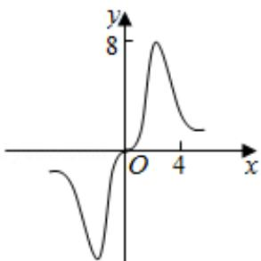
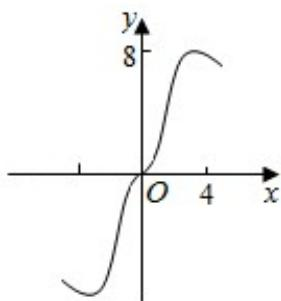
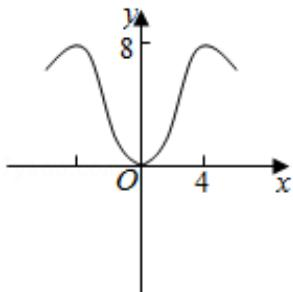
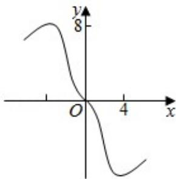

<!-- question-source:start -->
7.（5分）函数 $y = \frac{2x^3}{2^x + 2^{-x}}$ 在[-6,6]的图象大致为（）

A.

B.

C.

D.
<!-- question-source:end -->

![[高中/真题/按年份分类/2019/2019年全国统一高考数学试卷_理科__新课标ⅲ__含解析版_/选择题/题目/answers/Q00026892A1.md]]
