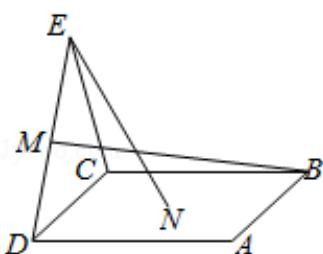

<!-- question-source:start -->
8. (5 分) 如图, 点 $N$ 为正方形 $ABCD$ 的中心, $\triangle ECD$ 为正三角形, 平面 $ECD \perp$ 平面 $ABCD$ , $M$ 是线段 $ED$ 的中点, 则 ( )

A. $BM = EN$ ，且直线 $BM$ ， $EN$ 是相交直线B. $BM = EN$ ，且直线 $BM$ ， $EN$ 是相交直线C. $BM = EN$ ，且直线 $BM$ ， $EN$ 是异面直线D. $BM = EN$ ，且直线 $BM$ ， $EN$ 是异面直线
<!-- question-source:end -->

![[高中/真题/按年份分类/2019/2019年全国统一高考数学试卷_理科__新课标ⅲ__含解析版_/选择题/题目/answers/Q00026893A1.md]]
