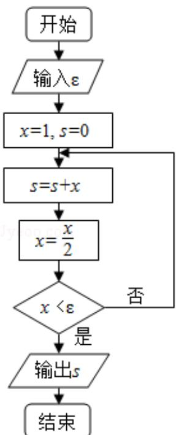

<!-- question-source:start -->
9. （5分）执行如图的程序框图，如果输入的 $\varepsilon$ 为0.01，则输出 $s$ 的值等于（）

A. $2 - \frac{1}{2^4}$ B. $2 - \frac{1}{2^5}$ C. $2 - \frac{1}{2^6}$ D. $2 - \frac{1}{2^7}$
<!-- question-source:end -->

![[高中/真题/按年份分类/2019/2019年全国统一高考数学试卷_理科__新课标ⅲ__含解析版_/选择题/题目/answers/Q00026894A1.md]]
