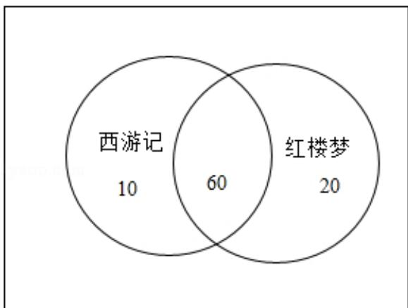

> [!faq]- 2019年全国统一高考数学试卷（理科）（新课标ⅲ）（含解析版）解析
>
> > [!success]- **【答案】** C
>
> > [!note]- **【分析】**
> > 作出维恩图, 得到该学校阅读过《西游记》的学生人数为 70 人, 由此能求出该学校
>
> > [!note]- **【解析】**
> > 解：某中学为了了解本校学生阅读四大名著的情况，随机调查了100位学生，其中阅读过《西游记》或《红楼梦》的学生共有90位，
> >
> > 阅读过《红楼梦》的学生共有80位，阅读过《西游记》且阅读过《红楼梦》的学生共有60位，作出维恩图，得：
> >
> > 
> >
> > ∴该学校阅读过《西游记》的学生人数为70人，
> > 则该学校阅读过《西游记》的学生人数与该学校学生总数比值的估计值为： $\frac{70}{100}=0.7$ .
> > 故选：C.
