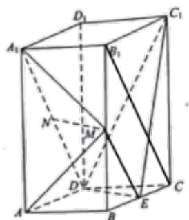

> [!faq]- 2019年山东省高考数学试卷(理科)word版试卷及解析解析
>
> > [!success]- **【答案】** （1）见解析； （2） $\frac{\sqrt{10}}{5}$
>
> > [!note]- **【分析】**
> > （1）利用三角形中位线和 $A_{1}D \parallel B_{1}C$ 可证得 $ME \parallel ND$ ，证得四边形 $MNDE$ 为平行四边形，进而证得 $MN \parallel DE$ ，根据线面平行判定定理可证得结论；
> > (2)以菱形 $ABCD$ 对角线交点为原点可建立空间直角坐标系，通过取 $AB$ 中点 $F$ ，可证得 $DF \perp$ 平面 $AMA_{1}$ ，得到平面 $AMA_{1}$ 的法向量 $DF$ ；再通过向量法求得平面 $MA_{1}N$ 的法向量 $n$ ，利用向量夹角公式求得两个法向量夹角的余弦值，进而可求得所求二面角的正弦值。
>
> > [!note]- **【解析】**
> > （1）连接 ME， $B_{1}C$
> >
> > 
> >
> > $\because M, E$ 分别为 $BB_{1}$ ， $BC$ 中点 $\therefore ME$ 为 $\Delta B_{1}BC$ 的中位线 $\therefore ME // B_{1}C$ 且 $ME = \frac{1}{2} B_{1}C$
> >
> > 又 $N$ 为 $A_{1}D$ 中点，且 $A_{1}D \underline{==} B_{1}C$ $\therefore ND // B_{1}C$ 且 $ND = \frac{1}{2} B_{1}C$
> >
> > $\therefore ME \underline{ // ND}$ $\therefore$ 四边形 $MNDE$ 为平行四边形
> >
> > $\therefore MN // DE$ ，又 $MN \notin$ 平面 $C_1DE$ ， $DE$ 平面 $C_1DE$
> >
> > $\therefore MN / /$ 平面 $C_1DE$
