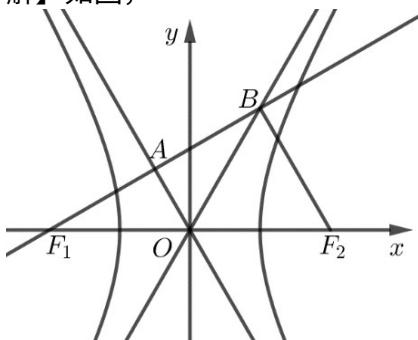

> [!faq]- 2019年山东省高考数学试卷(理科)word版试卷及解析解析
>
> > [!success]- **【答案】** 2. 【
>
> > [!note]- **【分析】**
> > 本题考查平面向量结合双曲线的渐进线和离心率, 渗透了逻辑推理、直观想象和数学运算素养. 采取几何法, 利用数形结合思想解题.
>
> > [!note]- **【解析】**
> > 如图，
> >
> > 
> >
> > 由 $F_{1}A = AB$ ，得 $F_{1}A = AB.$ 又 $OF_{1} = OF_{2}$ ，得OA是三角形 $F_{1}F_{2}B$ 的中位线，即 $BF_{2} / / OA, BF_{2} = 2OA.$ 由 $F_{1}B\square F_{2}B = 0$ ，得 $F_{1}B \perp F_{2}B, OA \perp F_{1}A,$ 则 $OB = OF_{1} = OF_{2}$ ，有
> >
> > $\angle OBF_{2} = \angle BF_{2}O = 2\angle OBF_{1} = 2\angle OF_{1}B,\angle AOB = \angle AOF_{1}$ ，又OA与OB都是渐近线，得
> >
> > $\angle BOF_{2} = \angle AOF_{1}$ ，则 $\angle BOF_{2} = 60^{0}$ ·又渐近线OB的斜率为 $\frac{b}{a} = \tan 60^0 = \sqrt{3}$ ，所以该双曲线的离心率为 $e = \frac{c}{a} = \sqrt{1 + (\frac{b}{a})^2} = \sqrt{1 + (\sqrt{3})^2} = 2.$
> >
> > 总结：此题若不能求出直角三角形的中位线的斜率将会思路受阻，即便知道双曲线渐近线斜率和其离心率的关系，也不能顺利求解，解题需要结合几何图形，关键得到 $\angle BOF_{2} = \angle AOF_{1} = \angle BOA_{2} = 60^{0}$ ，即得到渐近线的倾斜角为 $60^{0}$ ，从而突破问题障碍。
> >
> > ##
> > 三、解答题：共70分。
> >
> > （1） $\left(\sin B-\sin C\right)^{2}=\sin^{2}B-2\sin B\sin C+\sin^{2}C=\sin^{2}A-\sin B\sin C$
> >
> > 即： $\sin^2 B + \sin^2 C - \sin^2 A = \sin B\sin C$
> >
> > 由正弦定理可得： $b^{2} + c^{2} - a^{2} = bc$
> >
> > $$
> > \therefore \cos A = \frac {b ^ {2} + c ^ {2} - a ^ {2}}{2 b c} = \frac {1}{2}
> > $$
> >
> > $$
> > \because A \in (0, \pi) \quad \backslash A = \frac {\pi}{3}
> > $$
> > (2) $\because \sqrt{2} a + b = 2c$ ，由正弦定理得： $\sqrt{2}\sin A + \sin B = 2\sin C$
> >
> > 又 $\sin B = \sin (A + C) = \sin A\cos C + \cos A\sin C$ ， $A = \frac{\pi}{3}$
> >
> > $$
> > \therefore \sqrt {2} \times \frac {\sqrt {3}}{2} + \frac {\sqrt {3}}{2} \cos C + \frac {1}{2} \sin C = 2 \sin C
> > $$
> >
> > 整理可得： $3\sin C - \sqrt{6} = \sqrt{3}\cos C$
> >
> > $$
> > \because \sin^ {2} C + \cos^ {2} C = 1 \quad \therefore (3 \sin C - \sqrt {6}) ^ {2} = 3 (1 - \sin^ {2} C)
> > $$
> >
> > 解得： $\sin C=\frac{\sqrt{6}+\sqrt{2}}{4}$ 或 $\frac{\sqrt{6}-\sqrt{2}}{4}$
> >
> > 因为 $\sin B = 2\sin C - \sqrt{2}\sin A = 2\sin C - \frac{\sqrt{6}}{2} >0$ 所以 $\sin C > \frac{\sqrt{6}}{4}$ ，故 $\sin C = \frac{\sqrt{6} + \sqrt{2}}{4}$
> > (2) 法二： $\because \sqrt{2}a + b = 2c$ ，由正弦定理得： $\sqrt{2}\sin A + \sin B = 2\sin C$
> >
> > 又 $\sin B = \sin (A + C) = \sin A\cos C + \cos A\sin C$ ， $A = \frac{\pi}{3}$
> >
> > $$
> > \therefore \sqrt {2} \times \frac {\sqrt {3}}{2} + \frac {\sqrt {3}}{2} \cos C + \frac {1}{2} \sin C = 2 \sin C
> > $$
> >
> > 整理可得： $3\sin C - \sqrt{6} = \sqrt{3}\cos C$ ，即 $3\sin C - \sqrt{3}\cos C = 2\sqrt{3}\sin \left(C - \frac{\pi}{6}\right) = \sqrt{6}$
> >
> > $\therefore \sin \left(C - \frac{\pi}{6}\right) = \frac{\sqrt{2}}{2} \quad \therefore C = \frac{5\pi}{12} \text{或} \frac{11\pi}{12}$
> >
> > $\because A = \frac{\pi}{3}$ 且 $A + C <   \pi$ $\therefore C = \frac{5\pi}{12}$
> >
> > $$
> > \therefore \sin C = \sin \frac {5 \pi}{1 2} = \sin \left(\frac {\pi}{6} + \frac {\pi}{4}\right) = \sin \frac {\pi}{6} \cos \frac {\pi}{4} + \cos \frac {\pi}{6} \sin \frac {\pi}{4} = \frac {\sqrt {6} + \sqrt {2}}{4}
> > $$
> >
> > 总结: 本题考查利用正弦定理、余弦定理解三角形的问题, 涉及到两角和差正弦公式、同角三角函数关系的应用, 解题关键是能够利用正弦定理对边角关系式进行化简, 得到余弦定理的形式或角之间的关系.
