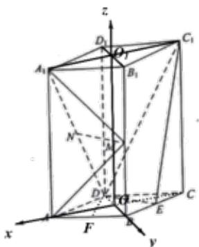

> [!faq]- 2019年山东省高考数学试卷(理科)word版试卷及解析解析
>
> > [!success]- **【答案】** （1）见
>
> > [!note]- **【分析】**
> > （1）利用三角形中位线和 $A_{1}D \parallel B_{1}C$ 可证得 $ME \parallel ND$ ，证得四边形 $MNDE$ 为平行四边形，进而证得 $MN \parallel DE$ ，根据线面平行判定定理可证得结论；
> > (2)以菱形 $ABCD$ 对角线交点为原点可建立空间直角坐标系，通过取 $AB$ 中点 $F$ ，可证得 $DF \perp$ 平面 $AMA_{1}$ ，得到平面 $AMA_{1}$ 的法向量 $DF$ ；再通过向量法求得平面 $MA_{1}N$ 的法向量 $n$ ，利用向量夹角公式求得两个法向量夹角的余弦值，进而可求得所求二面角的正弦值。
>
> > [!note]- **【解析】**
> > （1）连接 ME， $B_{1}C$
> >
> > 
> >
> > $\because M, E$ 分别为 $BB_{1}$ ， $BC$ 中点 $\therefore ME$ 为 $\Delta B_{1}BC$ 的中位线 $\therefore ME // B_{1}C$ 且 $ME = \frac{1}{2} B_{1}C$
> >
> > 又 $N$ 为 $A_{1}D$ 中点，且 $A_{1}D \underline{==} B_{1}C$ $\therefore ND // B_{1}C$ 且 $ND = \frac{1}{2} B_{1}C$
> >
> > $\therefore ME \underline{ // ND}$ $\therefore$ 四边形 $MNDE$ 为平行四边形
> >
> > $\therefore MN // DE$ ，又 $MN \notin$ 平面 $C_1DE$ ， $DE$ 平面 $C_1DE$
> >
> > $\therefore MN / /$ 平面 $C_1DE$
> > (2) 设 $AC \cap BD = O$ ， $A_{1}C_{1} \cap B_{1}D_{1} = O_{1}$
> >
> > 由直四棱柱性质可知： $OO_{1} \perp$ 平面 ABCD
> >
> > ∵ 四边形 ABCD 为菱形 ∴ AC ⊥ BD
> >
> > 则以 $O$ 为原点，可建立如下图所示的空间直角坐标系：
> >
> > 
> >
> > 则： $A(\sqrt{3},0,0), M(0,1,2), A_1(\sqrt{3},0,4), D(0,-1,0) N\left(\frac{\sqrt{3}}{2}, -\frac{1}{2}, 2\right)$
> >
> > 取 中点 ，连接 ，则 $F\left(\frac{\sqrt{3}}{2},\frac{1}{2},0\right)$
> >
> > ∵ 四边形 ABCD 为菱形且 $\angle BAD = 60^{\circ}$ ∴ $\Delta BAD$ 为等边三角形 ∴ $DF \perp AB$
> >
> > 又 $AA_{1}\perp$ 平面ABCD， $DF\subset$ 平面ABCD ∴ $DF\perp AA_{1}$
> >
> > $\therefore DF \perp$ 平面 $ABB_{1}A_{1}$ ，即 $DF \perp$ 平面 $AMA_{1}$
> >
> > $\therefore DF$ 为平面 $AMA_{1}$ 的一个法向量，且 $DF=\left(\frac{\sqrt{3}}{2},\frac{3}{2},0\right)$
> >
> > 设平面 $MA_{1}N$ 的法向量 $n=(x,y,z)$ ，又 $MA_{1}=\left(\sqrt{3},-1,2\right)$ ， $MN=\left(\frac{\sqrt{3}}{2},-\frac{3}{2},0\right)$
> >
> > $\therefore \left\{ \begin{array}{l}n\cdot MA_{1} = \sqrt{3} x - y + 2z = 0\\ \rightarrow \\ n\cdot MN = \frac{\sqrt{3}}{2} x - \frac{3}{2} y = 0 \end{array} \right.,$ 令 $x = \sqrt{3}$ ，则 $y = 1$ $z = -1$ $\therefore n = (\sqrt{3},1, - 1)$
> >
> > $\therefore \cos < DF, n > = \frac{DF \cdot n}{|DF| \cdot |n|} = \frac{3}{\sqrt{15}} = \frac{\sqrt{15}}{5}$ $\therefore \sin < DF, n > = \frac{\sqrt{10}}{5}$ 二面角 $A - MA_{1} - N$ 的正弦值为： $\frac{\sqrt{10}}{5}$
> >
> > 总结: 本题考查线面平行关系的证明、空间向量法求解二面角的问题. 求解二面角的关键是能够利用垂直关系建立空间直角坐标系，从而通过求解法向量夹角的余弦值来得到二面角的正弦值，属于常规题型.
