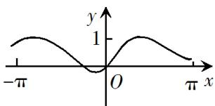
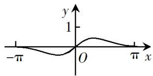
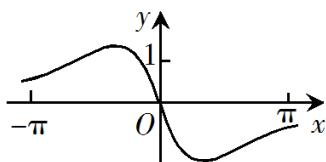
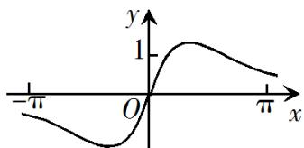

<!-- question-source:start -->
5. 函数 $f(x) = \overline{\cos x + x^2}$ 在 $[- \pi, \pi]$ 的图像大致为

A.

B.

C.

D.

<!-- question-source:end -->

![[高中/真题/按年份分类/2019/2019年山东省高考数学试卷_理科_word版试卷及解析/选择题/题目/answers/Q00025824A1.md]]
