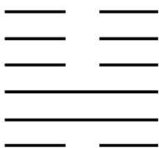

<!-- question-source:start -->
6. 我国古代典籍《周易》用“卦”描述万物的变化。每一“重卦”由从下到上排列的6个爻组成，爻分为阳爻“——”和阴爻“——”，如图就是一重卦。在所有重卦中随机取一重卦，则该重卦恰有3个阳爻的概率是

A. $\frac{5}{16}$ B. $\frac{11}{32}$ C. $\frac{21}{32}$ D. $\frac{11}{16}$
<!-- question-source:end -->

![[高中/真题/按年份分类/2019/2019年山东省高考数学试卷_理科_word版试卷及解析/选择题/题目/answers/Q00025825A1.md]]
