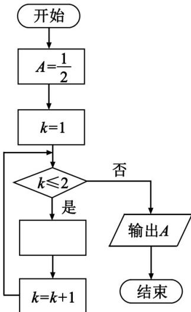

<!-- question-source:start -->
8. 如图是求 $\frac{1}{2 + \frac{1}{2 + \frac{1}{2}}}$ 的程序框图，图中空白框中应填入

A. $A = \frac{1}{2 + A}$ B. $A = 2 + \frac{1}{A}$ C. $A = \frac{1}{1 + 2A}$ D. $A = 1 + \frac{1}{2A}$
<!-- question-source:end -->

![[高中/真题/按年份分类/2019/2019年山东省高考数学试卷_理科_word版试卷及解析/选择题/题目/answers/Q00025827A1.md]]
