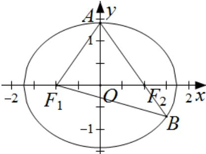

> [!faq]- 2019年山东省高考数学试卷(理科)word版试卷及解析解析
>
> > [!success]- **【答案】** B
>
> > [!note]- **【分析】**
> > 可以运用下面方法求解：如图，由已知可设 $\left|F_{2}B\right|=n$ ，则 $\left|AF_{2}\right|=2n,\left|BF_{1}\right|=\left|AB\right|=3n$ ，由椭圆的定义有 $2a=\left|BF_{1}\right|+\left|BF_{2}\right|=4n,\therefore\left|AF_{1}\right|=2a-\left|AF_{2}\right|=2n$ 。在 $\triangle AF_{1}F_{2}$ 和 $\triangle BF_{1}F_{2}$ 中，由余弦定理得 $\left\{\begin{aligned}&4n^{2}+4-2\cdot2n\cdot2\cdot\cos\angle AF_{2}F_{1}=4n^{2},\\ &n^{2}+4-2\cdot n\cdot2\cdot\cos\angle BF_{2}F_{1}=9n^{2}\end{aligned}\right.$ ，又 $\angle AF_{2}F_{1},\angle BF_{2}F_{1}$ 互补， $\therefore\cos\angle AF_{2}F_{1}+\cos\angle BF_{2}F_{1}=0$ ，两式消去 $\cos\angle AF_{2}F_{1},\cos\angle BF_{2}F_{1}$ ，得 $3n^{2}+6=11n^{2}$ ，解得 $n=\frac{\sqrt{3}}{2}$ 。
>
> > [!note]- **【解析】**
> > 【分析】
> >
> > 可以运用下面方法求解：如图，由已知可设 $\left|F_{2}B\right|=n$ ，则 $\left|AF_{2}\right|=2n,\left|BF_{1}\right|=\left|AB\right|=3n$ ，由椭圆的定义有 $2a=\left|BF_{1}\right|+\left|BF_{2}\right|=4n,\therefore\left|AF_{1}\right|=2a-\left|AF_{2}\right|=2n$ 。在 $\triangle AF_{1}F_{2}$ 和 $\triangle BF_{1}F_{2}$ 中，由余弦定理得 $\left\{\begin{aligned}&4n^{2}+4-2\cdot2n\cdot2\cdot\cos\angle AF_{2}F_{1}=4n^{2},\\ &n^{2}+4-2\cdot n\cdot2\cdot\cos\angle BF_{2}F_{1}=9n^{2}\end{aligned}\right.$ ，又 $\angle AF_{2}F_{1},\angle BF_{2}F_{1}$ 互补， $\therefore\cos\angle AF_{2}F_{1}+\cos\angle BF_{2}F_{1}=0$ ，两式消去 $\cos\angle AF_{2}F_{1},\cos\angle BF_{2}F_{1}$ ，得 $3n^{2}+6=11n^{2}$ ，解得 $n=\frac{\sqrt{3}}{2}$ 。
> >
> > $\therefore 2a = 4n = 2\sqrt{3}, \therefore a = \sqrt{3}, \therefore b^2 = a^2 - c^2 = 3 - 1 = 2, \therefore$ 所求椭圆方程为 $\frac{x^2}{3} + \frac{y^2}{2} = 1$ ，故选B.
> >
> > $$
> > \left| F _ {2} B \right| = n
> > $$
> >
> > $$
> > \left| A F _ {2} \right| = 2 n, \left| B F _ {1} \right| = \left| A B \right| = 3 n
> > $$
> >
> > $2a=\left|BF_{1}\right|+\left|BF_{2}\right|=4n,\therefore\left|AF_{1}\right|=2a-\left|AF_{2}\right|=2n.$ 在 $\triangle AF_{1}B$ 中，由余弦定理推论得 $\cos\angle F_{1}AB=\frac{4n^{2}+9n^{2}-9n^{2}}{2\cdot2n\cdot3n}=\frac{1}{3}.$ 在 $\triangle AF_{1}F_{2}$ 中，由余弦定理得 $4n^{2}+4n^{2}-2\cdot2n\cdot2n\cdot\frac{1}{3}=4,$ 解得 $n=\frac{\sqrt{3}}{2}.$ $\therefore 2a=4n=2\sqrt{3},\therefore a=\sqrt{3},\therefore b^{2}=a^{2}-c^{2}=3-1=2,\therefore$ 所求椭圆方程为 $\frac{x^{2}}{3}+\frac{y^{2}}{2}=1$ ，故选 B.
> >
> > 
> >
> > 总结: 本题考查椭圆标准方程及其简单性质, 考查数形结合思想、转化与化归的能力, 很好的落实了直观想象、逻辑推理等数学素养.
