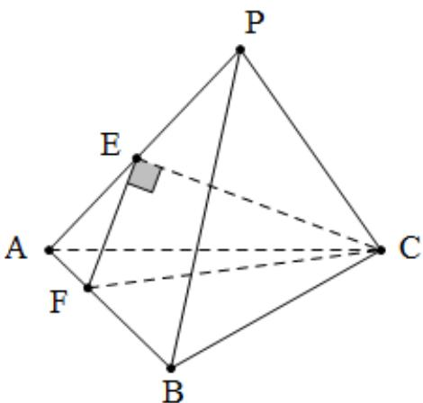

> [!faq]- 2019年山东省高考数学试卷(理科)word版试卷及解析解析
>
> > [!success]- **【答案】** D
>
> > [!note]- **【分析】**
> > 本题也可用解三角形方法，达到求出棱长的目的．适合空间想象能力略差学生．
>
> > [!note]- **【解析】**
> > ∵ PA = PB = PC， $\Delta ABC$ 为边长为 2 的等边三角形，∴ P - ABC 为正三棱锥，
> >
> > $\therefore PB \perp AC$ ，又 $E$ ， $F$ 分别 $PA$ 、 $AB$ 中点，
> >
> > $\therefore EF // PB, \therefore EF \perp AC$ , 又 $EF \perp CE, CE \cap AC = C, \therefore EF \perp$ 平面 $PAC, PB \perp$ 平面 $PAC, \therefore \angle PAB = 90^\circ, \therefore PA = PB = PC = \sqrt{2}, \therefore P - ABC$ 为正方体一部分， $2R = \sqrt{2 + 2 + 2} = \sqrt{6}$ ，即 $R = \frac{\sqrt{6}}{2}, \therefore V = \frac{4}{3}\pi R^3 = \frac{4}{3}\pi \times \frac{6\sqrt{6}}{8} = \sqrt{6}\pi$ ，故选 D.
> >
> > 
> >
> > 总结: 本题考查学生空间想象能力, 补型法解决外接球问题. 可通过线面垂直定理, 得到三棱两两互相垂直关系, 快速得到侧棱长, 进而补型成正方体解决.
> >
> > ##
