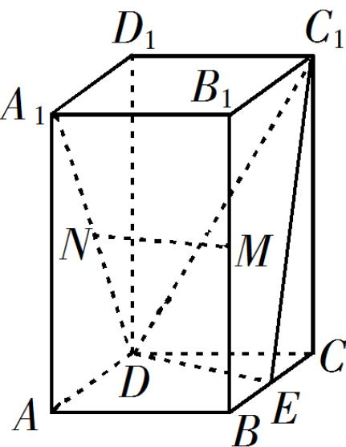

<!-- question-source:start -->
19. (12 分)

如图，直四棱柱 $ABCD-A_{1}B_{1}C_{1}D_{1}$ 的底面是菱形， $AA_{1}=4,\ AB=2,\ \angle BAD=60^{\circ},\ E,\ M,\ N$ 分别是 BC, $BB_{1}$ , $A_{1}D$ 的中点.

<!-- question-source:end -->

![[高中/真题/按年份分类/2019/2019年山东高考文科数学真题及答案/填空题/题目/answers/Q00028943A1.md]]
