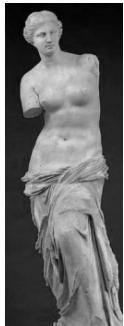

<!-- question-source:start -->
4. 古希腊时期, 人们认为最美人体的头顶至肚脐的长度与肚脐至足底的长度之比是 $\frac{\sqrt{5} - 1}{2}$ ( $\frac{\sqrt{5} - 1}{2} \approx 0.618$ , 称为黄金分割比例), 著名的“断臂维纳斯”便是如此. 此外, 最美人

体的头顶至咽喉的长度与咽喉至肚脐的长度之比也是 $\frac{\sqrt{5} - 1}{2}$ 。若某人满足上述两个黄金分割比例，且腿长为 $105\mathrm{cm}$ ，头顶至脖子下端的长度为 $26\mathrm{cm}$ ，则其身高可能是

A. $165 \mathrm{~cm}$ B. $175 \mathrm{~cm}$ C. $185 \mathrm{~cm}$ D. $190 \mathrm{~cm}$

$$
f (x) = \frac {\sin x + x}{\cos x + x ^ {2}}
$$
<!-- question-source:end -->

![[高中/真题/按年份分类/2019/2019年山东高考文科数学真题及答案/选择题/题目/answers/Q00026435A1.md]]
