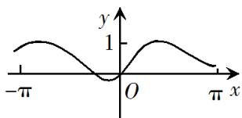
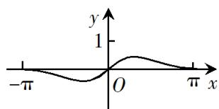
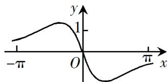
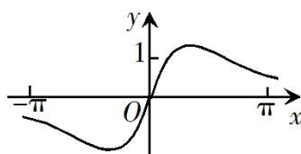

<!-- question-source:start -->
5. 函数 $f(x) = \cos x + x^2$ 在 $[- \pi, \pi]$ 的图像大致为

A.

B.

C.

D.

<!-- question-source:end -->

![[高中/真题/按年份分类/2019/2019年山东高考文科数学真题及答案/选择题/题目/answers/Q00026436A1.md]]
