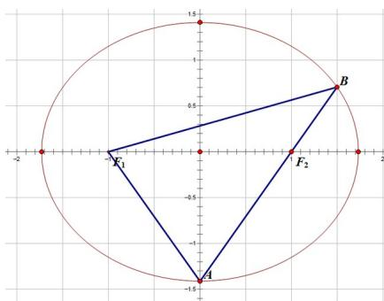

> [!faq]- 2019年山东高考文科数学真题及答案解析
>
> > [!success]- **【答案】** B
>
> > [!note]- **【分析】**
> > 本题未单列分析。
>
> > [!note]- **【解析】**
> > 答案:
> >
> > B
> >
> > 解答：
> >
> > 由 $\left|AF_{2}\right|=2\left|F_{2}B\right|$ ， $\left|AB\right|=\left|BF_{1}\right|$ ，设 $\left|F_{2}B\right|=x$ ，则 $\left|AF_{2}\right|=2x$ ， $\left|BF_{1}\right|=3x$ ，根据椭圆的定义 $\left|F_{2}B\right|+\left|BF_{1}\right|=\left|AF_{2}\right|+\left|AF_{1}\right|=2a$ ，所以 $\left|AF_{1}\right|=2x$ ，因此点A即为椭圆的下顶点，因为 $\left|AF_{2}\right|=2\left|F_{2}B\right|$ ，c=1所以点B坐标为 $\left(\frac{3}{2},\frac{b}{2}\right)$ ，将坐标代入椭圆方程得 $\frac{9}{4a^{2}}+\frac{1}{4}=1$ ，解得 $a^{2}=3,b^{2}=2$ ，故
> > 答案选B.
> >
> > 
