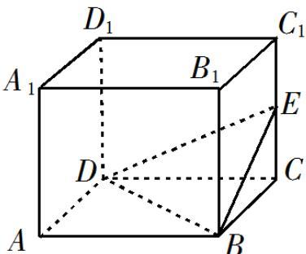

<!-- question-source:start -->
9. 如图，长方体 $ABCD - A_1B_1C_1D_1$ 的体积是 120， $E$ 为 $CC_1$ 的中点，则三棱锥 $E-BCD$ 的体积是 $\triangle$ .

<!-- question-source:end -->

![[高中/真题/按年份分类/2019/2019年江苏高考数学试题及答案/填空题/题目/answers/Q00026798A1.md]]
