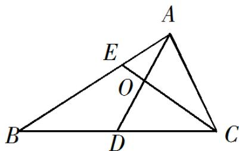

<!-- question-source:start -->
12．如图，在 $\triangle ABC$ 中， $D$ 是 $BC$ 的中点， $E$ 在边 $AB$ 上， $BE = 2EA$ ， $AD$ 与 $CE$ 交于点 $O$ . 若 $AB \cdot AC = 6AO \cdot EC$ ，则 $\frac{AB}{AC}$ 的值是 $\triangle$ .

<!-- question-source:end -->

![[高中/真题/按年份分类/2019/2019年江苏高考数学试题及答案/填空题/题目/answers/Q00026801A1.md]]
