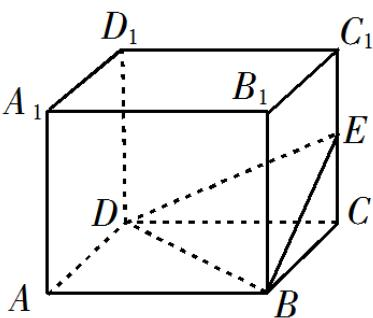

<!-- question-source:start -->
9.如图，长方体 $ABCD - A_{1}B_{1}C_{1}D_{1}$ 的体积是 120，E 为 $CC_{1}$ 的中点，则三棱锥 E-BCD 的体积是 \_\_\_\_.

【
<!-- question-source:end -->

![[高中/真题/按年份分类/2019/2019年江苏高考数学试题及答案/填空题/题目/answers/Q00028975A1.md]]
