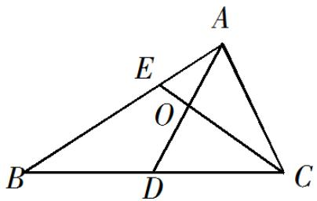

<!-- question-source:start -->
12.如图，在 $\forall ABC$ 中， $D$ 是 $BC$ 的中点， $E$ 在边 $AB$ 上， $BE = 2EA, AD$ 与 $CE$ 交于点 $O$ .若 $AB\cdot AC = 6AO\cdot EC$

则 AC 的值是\_\_\_\_.

【
<!-- question-source:end -->

![[高中/真题/按年份分类/2019/2019年江苏高考数学试题及答案/填空题/题目/answers/Q00028978A1.md]]
