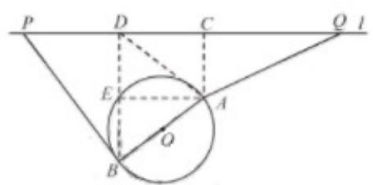

> [!faq]- 2019年江苏高考数学试题及答案解析
>
> > [!success]- **【答案】** (1) 15 (百米); (2) 见解析； (3) $17^{+} \sqrt[3]{21}$ （百米）
>
> > [!note]- **【分析】**
> > 解：解法一：
> > (1) 过 $A$ 作 $AE \perp BD$ ，垂足为 $E$ . 利用几何关系即可求得道路 $PB$ 的长；
> > (2) 分类讨论 $P$ 和 $Q$ 中能否有一个点选在 $D$ 处即可.
> > (3) 先讨论点 $P$ 的位置，然后再讨论点 $Q$ 的位置即可确定当 $d$ 最小时， $P$ 、 $Q$ 两点间的距离.
> > (1) 建立空间直角坐标系，分别确定点 $P$ 和点 $B$ 的坐标，然后利用两点之间距离公式可得道路 $PB$ 的长；
> > (2) 分类讨论 $P$ 和 $Q$ 中能否有一个点选在 $D$ 处即可.
> > (3) 先讨论点 $P$ 的位置，然后再讨论点 $Q$ 的位置即可确定当 $d$ 最小时， $P$ 、 $Q$ 两点间的距离.
>
> > [!note]- **【解析】**
> > 解法一：
> > (1) 过 $A$ 作 $AE \perp BD$ , 垂足为 $E$ .
> >
> > 由已知条件得，四边形 $ACDE$ 为矩形，
> >
> > $$
> > D E = B E = A C = 6, A E = C D = 8
> > $$
> >
> > 因为 $PB \perp AB$
> >
> > 所以 $\cos\angle PBD=\sin\angle ABE=\frac{8}{10}=\frac{4}{5}$ .
> >
> > $$
> > \begin{array}{c} P B = \frac {B D}{\cos \angle P B D} = \frac {1 2}{\frac {4}{5}} = 1 5 \\ \text {所以} \end{array} .
> > $$
> >
> > 因此道路 $PB$ 的长为15（百米）.
> >
> > 
> >
> > (2) ① 若 $P$ 在 $D$ 处, 由
> > (1) 可得 $E$ 在圆上, 则线段 $BE$ 上的点 (除 $B, E$ ) 到点 $O$ 的距离均小于圆 $O$ 的半径, 所以
> >
> > P 选在 D 处不满足规划要求.
> >
> > ② 若 Q 在 D 处，连结 AD，由
> > （1）知 $AD = \sqrt{AE^{2} + ED^{2}} = 10$ ，
> >
> > 从而 $\cos\angle BAD=\frac{AD^{2}+AB^{2}-BD^{2}}{2AD\cdot AB}=\frac{7}{25}>0$ ，所以 $\angle BAD$ 为锐角.
> >
> > 所以线段 AD 上存在点到点 O 的距离小于圆 O 的半径.
> >
> > 因此，Q 选在 D 处也不满足规划要求.
> >
> > 综上，P 和 Q 均不能选在 D 处.
> > (3) 先讨论点 P 的位置.
> >
> > 当 $\angle OBP < 90^{\circ}$ 时，线段 $PB$ 上存在点到点 $O$ 的距离小于圆 $O$ 的半径，点 $P$ 不符合规划要求；
> >
> > 当 $\angle OBP \geq 90^{\circ}$ 时，对线段 $PB$ 上任意一点 $F, OF \geq OB$ ，即线段 $PB$ 上所有点到点 $O$ 的距离均不小于圆 $O$ 的半径，点 $P$ 符合规划要求.
> >
> > 设 $a^{x+y}=M\cdot N$ 为l上一点，且 $P_{1}B\perp AB$ ，由
> > （1）知， $P_{1}B=15$
> >
> > 此时 $P_{1}D = P_{1}B \sin \angle P_{1}BD = P_{1}B \cos \angle EBA = 15 \times \frac{3}{5} = 9$ ;
> >
> > 当 $\angle OBP > 90^{\circ}$ 时，在 $\triangle PP_{1}B$ 中， $PB > P_{1}B = 15$
> >
> > 由上可知， $d\geq 15$
> >
> > 再讨论点 Q 的位置.
> >
> > 由
> > （2）知，要使得 $QA \geq 15$ ，点 $Q$ 只有位于点 $C$ 的右侧，才能符合规划要求.当 $QA = 15$ 时，
> >
> > $CQ = \sqrt{QA^2 - AC^2} = \sqrt{15^2 - 6^2} = 3\sqrt{21}$ . 此时，线段 $QA$ 上所有点到点 $O$ 的距离均不小于圆 $O$ 的半径.
> >
> > 综上，当 $PB \perp AB$ ，点 $Q$ 位于点 $C$ 右侧，且 $CQ = 3\sqrt{21}$ 时， $d$ 最小，此时 $P$ ， $Q$ 两点间的距离
> >
> > $$
> > P Q = P D + C D + C Q = 1 7 + 3 \sqrt {2 1}.
> > $$
> >
> > 因此， $d$ 最小时， $P$ ， $Q$ 两点间的距离为 $17 + \sqrt[3]{21}$ （百米）.
> >
> > 解法二：
