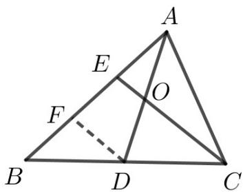

> [!faq]- 2019年江苏高考数学试题及答案解析
>
> > [!success]- **【答案】** $\sqrt{3}$ 【
>
> > [!note]- **【分析】**
> > 由题意将原问题转化为基底的数量积，然后利用几何性质可得比值.
>
> > [!note]- **【解析】**
> > 如图，过点 D 作 DF//CE，交 AB 于点 F，由 BE=2EA，D 为 BC 中点，知 BF=FE=EA, AO=OD.
> >
> > 
> >
> > $$
> > 6 A O \square E C = 3 A D \square (A C - A E) = \frac {3}{2} (A B + A C) \square (A C - A E)
> > $$
> >
> > $$
> > = \frac {3}{2} (A B + A C) \left[ \left(A C - \frac {1}{3} A B\right) = \frac {3}{2} \left(A B \square A C - \frac {1}{3} A B ^ {2} + A C ^ {2} - \frac {1}{3} A B \square A C\right) \right.
> > $$
> >
> > $$
> > = \frac {3}{2} \left(\frac {\vec {2}}{3} A B \square A C - \frac {1}{3} A B ^ {2} + A C ^ {2}\right) = A B \square A C - \frac {1}{2} A B ^ {2} + \frac {3}{2} A C ^ {2} = A B \square A C
> > $$
> >
> > 得 $\frac{1}{2} AB^2 = \frac{3}{2} AC^2$ 即 $\left|AB\right| = \sqrt{3}\left|AC\right|$ 故 $\frac{AB}{AC} = \sqrt{3}$
> >
> > 【点睛】本题考查在三角形中平面向量的数量积运算，渗透了直观想象、逻辑推理和数学运算素养.采取几何法，利用数形结合和方程思想解题.
