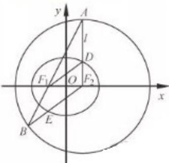
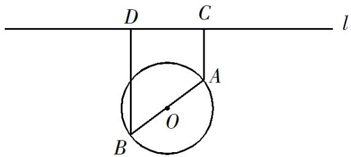

<!-- question-source:start -->
16. （本小题满分 14 分）

如图，在直三棱柱 $ABC-A_{1}B_{1}C_{1}$ 中，D，E 分别为 BC，AC 的中点，AB=BC.

求证：（1） $A_{1}B_{1}\|$ 平面 $DEC_{1}$

(2) $BE \perp C_{1}E$ .

## 17. （本小题满分 14 分）

如图，在平面直角坐标系 $xOy$ 中，椭圆 $C: \frac{x^2}{a^2} + \frac{y^2}{b^2} = 1 (a > b > 0)$ 的焦点为 $F_1(-1, 0)$ ，

$F_{2}(1,0)$ .过 $F_{2}$ 作 $x$ 轴的垂线 $l$ ，在 $x$ 轴的上方， $l$ 与圆 $F_{2}:(x - 1)^{2} + y^{2} = 4a^{2}$ 交于点 $A$ ，与椭圆 $C$ 交于点D.连结 $AF_{1}$ 并延长交圆 $F_{2}$ 于点 $B$ ，连结 $BF_{2}$ 交椭圆 $C$ 于点 $E$ ，连结 $DF_{1}$

已知 $DF_{1}=\frac{5}{2}$ .

(1) 求椭圆 C 的标准方程;

(2) 求点 E 的坐标.

## 18. （本小题满分 16 分）

如图, 一个湖的边界是圆心为 O 的圆, 湖的一侧有一条直线型公路 l, 湖上有桥 AB (AB 是圆 O 的直径). 规划在公路 l 上选两个点 P、Q, 并修建两段直线型道路 PB、QA. 规划要求: 线段 PB、QA 上的所有点到点

O 的距离均不小于圆 O 的半径．已知点 A、B 到直线 l 的距离分别为 AC 和 BD（C、D 为垂足），测得 AB=10，AC=6，BD=12（单位:百米）.

(1) 若道路 $PB$ 与桥 $AB$ 垂直, 求道路 $PB$ 的长;

(2) 在规划要求下， $P$ 和 $Q$ 中能否有一个点选在 $D$ 处？并说明理由；

(3) 对规划要求下, 若道路 $PB$ 和 $QA$ 的长度均为 $d$ (单位: 百米). 求当 $d$ 最小时, $P 、 Q$ 两点间的距离.

## 19. （本小题满分 16 分）

设函数 $f(x)=(x-a)(x-b)(x-c),a,b,c\in\mathbb{R}$ 、 $f'(x)$ 为 $f(x)$ 的导函数.

(1) 若 a=b=c，f (4) =8，求 a 的值；

(2) 若 $a = b, b = c$ ，且 $f(x)$ 和 $f'(x)$ 的零点均在集合 $\{-3, 1, 3\}$ 中，求 $f(x)$ 的极小值；

(3) 若 $a = 0, 0 < b_{n}, 1, c = 1$ ，且 $f(x)$ 的极大值为 $M$ ，求证: $M \leq \frac{4}{27}$ .

## 20. (本小满分 16 分)

定义首项为 1 且公比为正数的等比数列为 “M—数列”.

(1) 已知等比数列 $\{a_{n}\} (n\in \mathbf{N}^{*})$ 满足： $a_2a_4 = a_5,a_3 - 4a_2 + 4a_1 = 0$ ，求证:数列 $\{a_n\}$ 为“M一数列”；

(2) 已知数列 $\{b_{n}\}$ 满足: $b_{1} = 1, \frac{1}{S_{n}} = \frac{2}{b_{n}} - \frac{2}{b_{n + 1}}$ , 其中 $S_{n}$ 为数列 $\{b_{n}\}$ 的前 $n$ 项和.

① 求数列 $\{b_{n}\}$ 的通项公式；

② 设 m 为正整数，若存在 “M—数列” $\{c_{n}\}(n\in\mathbf{N}^{*})$ ，对任意正整数 k，当 $k\leq m$ 时，都有 $c_{k}\leq b_{k}\leq c_{k+1}$ 成立，求 m 的最大值.

## 数学II(附加题)
<!-- question-source:end -->

![[高中/真题/按年份分类/2019/2019年江苏高考数学试题及答案/解答题/题目/answers/Q00026805A1.md]]
