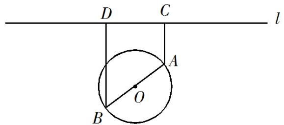

<!-- question-source:start -->
18.如图, 一个湖的边界是圆心为 $O$ 的圆, 湖的一侧有一条直线型公路 $l$ , 湖上有桥 $AB$ (AB 是圆 $O$ 的直径). 规划在公路 $l$ 上选两个点 $P 、 Q$ , 并修建两段直线型道路 $PB 、 QA$ . 规划要求: 线段 $PB 、 QA$ 上的所有点到点 $O$ 的

距离均不小于圆 O 的半径．已知点 A、B 到直线 l 的距离分别为 AC 和 BD（C、D 为垂足），测得 AB=10，AC=6，BD=12 （单位:百米）．

(1) 若道路 $PB$ 与桥 $AB$ 垂直, 求道路 $PB$ 的长;

(2) 在规划要求下， $P$ 和 $Q$ 中能否有一个点选在 $D$ 处？并说明理由；

(3) 对规划要求下, 若道路 $PB$ 和 $QA$ 的长度均为 $d$ (单位: 百米). 求当 $d$ 最小时, $P 、 Q$ 两点间的距离.

【
<!-- question-source:end -->

![[高中/真题/按年份分类/2019/2019年江苏高考数学试题及答案/解答题/题目/answers/Q00026810A1.md]]
