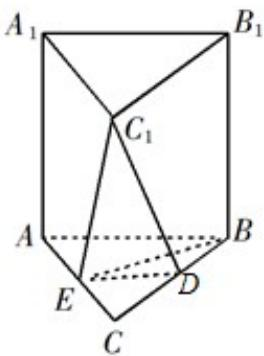

<!-- question-source:start -->
16.如图，在直三棱柱 $ABC-A_{1}B_{1}C_{1}$ 中，D，E 分别为 BC，AC 的中点，AB=BC.

求证：
（1） $A_{1}B_{1}\|$ 平面 $DEC_{1}$

(2) $BE \perp C_{1}E$ .

【
<!-- question-source:end -->

![[高中/真题/按年份分类/2019/2019年江苏高考数学试题及答案/解答题/题目/answers/Q00028982A1.md]]
